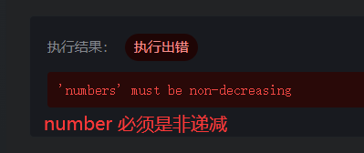
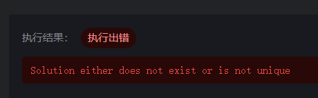
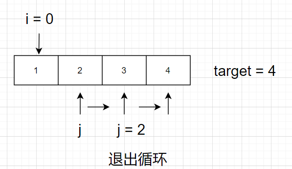
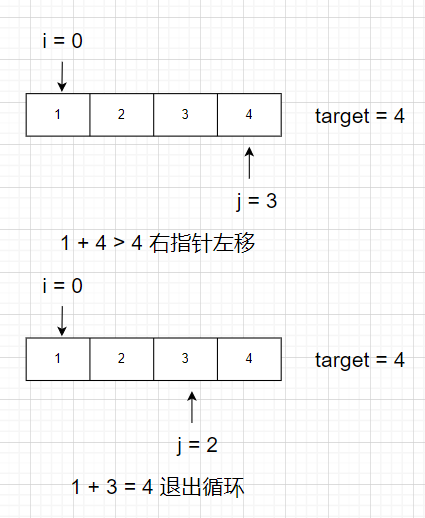

# leetcode_167. 两数之和 II - 输入有序数组

题目链接: [167. 两数之和 II - 输入有序数组](https://leetcode-cn.com/problems/two-sum-ii-input-array-is-sorted/)

# 题目

给你一个下标从 1 开始的整数数组`numbers`，该数组已按**非递减顺序排列**，请你从数组中找出满足相加之和等于目标数 `target` 的两个数。如果设这两个数分别是 `numbers[index1]` 和 `numbers[index2]`，则 `1 <= index1 < index2 <= numbers.length`。

以长度为 2 的整数数组 `[index1, index2]` 的形式返回这两个整数的下标 `index1` 和 `index2`。

你可以假设每个输入**只对应唯一的答案**，而且你**不可以**重复使用相同的元素。

你所设计的解决方案必须只使用常量级的额外空间。

## 示例 1

```
输入：numbers = [2,7,11,15], target = 9
输出：[1,2]
解释：2 与 7 之和等于目标数 9 。因此 index1 = 1, index2 = 2 。返回 [1, 2] 。
```

## 示例 2

```
输入：numbers = [2,3,4], target = 6
输出：[1,3]
解释：2 与 4 之和等于目标数 6 。因此 index1 = 1, index2 = 3 。返回 [1, 3] 。
```

## 示例 3

```
输入：numbers = [-1,0], target = -1
输出：[1,2]
解释：-1 与 0 之和等于目标数 -1 。因此 index1 = 1, index2 = 2 。返回 [1, 2] 。
```

## 提示

- `2 <= numbers.length <= 3 \* 104`
- `-1000 <= numbers[i] <= 1000`
- `numbers` 按**非递减顺序**排列
- `-1000 <= target <= 1000`
- **仅存在一个有效答案**

## 代码模板

```js
/**
 * @param {number[]} numbers
 * @param {number} target
 * @return {number[]}
 */
var twoSum = function (numbers, target) {};
```

# 解法

首先看到这道题最应该关注的是被加粗的关键词，比如**非递减顺序排列**，像这个非递减到底是怎么改非递减法呢？是不是就是递增？这个时候就需要一个个小小的测试看一下了

```
设计部分递减，测试用例如下

输入：numbers = [1,3,2,4], target = 5
```

最终结果如下图



所以**非递减**就是递增？可能是数组中存在重复的元素不算是递增？就像下面的测试例子一样

```
下面这个测试用例可以通过 leetcode 的测试

输入：numbers = [1,3,3,4], target = 5
```

那么确立了**非递增**的概念之后我们可以继续分析题目，另外两个关键词

1. 只对应唯一的答案
2. 不可以重复使用相同的元素

第二个好判断，就是答案不能使用数组中索引相同的元素（这个就算你返回了也不是 `leetcode` 对应的答案）

只对应唯一答案，就是不可以有两个答案和**没有答案**，注意小细节测试用例**没有答案**也是不行的，像下面这个测试用例是不能够通过的

```
输入：numbers = [1,2,3,4], target = 8
```



搞清楚上面这些定义以后就可以实操题目了，找出满足相加之和等于目标数 `target` 的两个数，还是一个数组！作为 `for` 循环集大成者，所有检索我都先暴力一波 `for` 循环，甭管它什么简单题中等题困难题，你要是找两个数我就两个 `for` 循环

这个解法我信手捏来，代码如下

```js
var twoSum = function (numbers, target) {
  const res = [-1, -1];
  for (let i = 0; i < numbers.length; i++) {
    res[0] = i;
    for (let j = i + 1; j < numbers.length; j++) {
      if (target - numbers[res[0]] === numbers[j]) {
        res[1] = j;
        // 下标需为 1 开始
        res[0] = res[0] + 1;
        res[1] = res[1] + 1;
        return res;
      }
    }
  }
  return res;
};
```

它的解法思路如下，就是求数组的两两组合的次数的过程中判断是否有满足条件的，小学数学啦



时间复杂度在 `O(n^2)`，不用想了这个复杂度一般都过不了的

但是小细节了家人们，这可是一个**非递增**序的数组呀，就是有没有一种可能我们能够找到一种规律去优化检索算法呢？

## 左右指针解法

答案就是双指针，准确来说是左右指针，在一次遍历数组的情况下帮助我们去缩小范围，其思路如下



当 `number[j] + number[i] > target` 时，右指针左移，原因是

```
number[n] 为递增数组
所以 number[i+1] > number[i], number[j] > number[j-1]

则有
number[i+1] + number[j] > target
number[i] + number[j-1] 有可能 > 或 = 或 < target

为了找到满足条件的数组元素，应该使右指针左移
```

同理，当 `number[j] + number[i] < target` 时

```
必然有
number[i] + number[j-1] < target

为了找到满足条件的数组元素，应该使左指针右移
```

因此这道题的解法为

```js
var twoSum = function (numbers, target) {
  let left = 0,
    right = numbers.length;
  while (left < right) {
    const sum = numbers[left] + numbers[right];
    if (sum === target) {
      return [left + 1, right + 1];
    } else if (sum < target) {
      left++;
    } else {
      right--;
    }
  }
  return [-1, -1];
};
```

这个算法的时间复杂度是 `O(n)` 最坏的情况就是整个数组都遍历完，符合条件的元素邻近，比如 `numbers = [0,3,3,4,5], target = 6`，空间复杂度为 `O(1)`，因为我们只用到了三个变量

# 拓展-哈希求解

其实 `O(n)` 的复杂度用哈希也是能够求解的，但是设置 `Map` 的空间复杂度达到了 `O(n)`（最坏的情况下）因此不满足这道题的条件，但是在这道题的 `mini` 版，`1. 两数之和`(https://leetcode-cn.com/problems/two-sum/)，是可以使用这种思路的，下面给出这道题的哈希解法（如果不限制空间的话）

```js
var twoSum = function (numbers, target) {
  let numsMap = new Map();
  for (let i = 0; i < numbers.length; i++) {
    if (numsMap.has(target - numbers[i])) {
      return [numsMap.get(target - numbers[i]), i];
    }
    numsMap.set(nums[i], i);
  }
};
```
