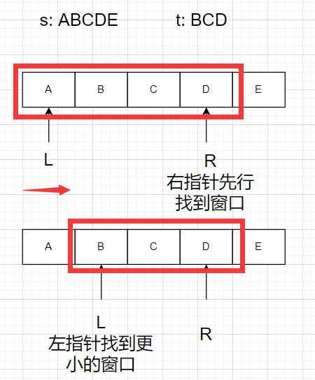
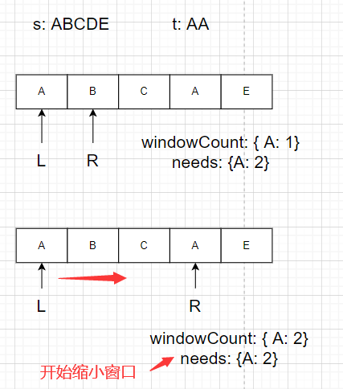
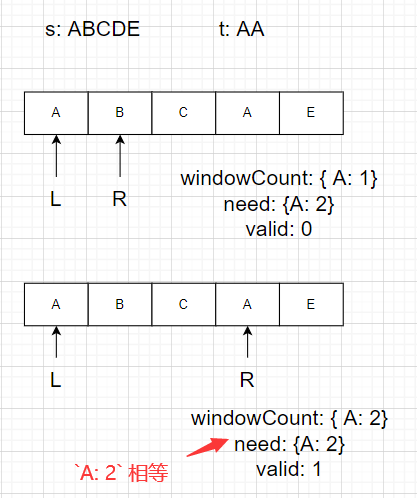
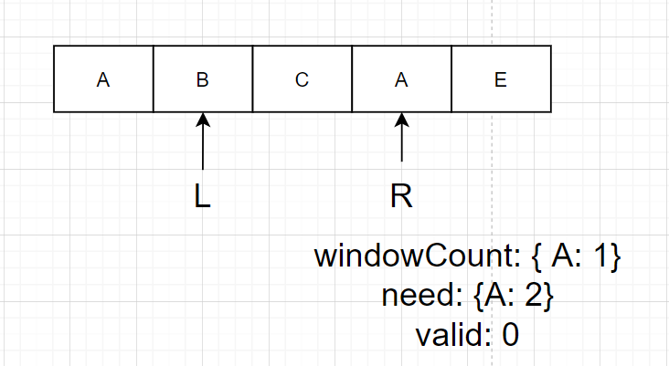

# leetcode_76. 最小覆盖子串

题目链接: [76. 最小覆盖子串](https://leetcode-cn.com/problems/minimum-window-substring/)

# 题目

给你一个字符串 `s` 、一个字符串 `t` 。返回 `s` 中涵盖 `t` 所有字符的最小子串。如果 `s` 中不存在涵盖 t 所有字符的子串，则返回空字符串 "" 。

**注意：**

- 对于 `t` 中重复字符，我们寻找的子字符串中该字符数量必须不少于 t 中该字符数量。
- 如果 `s` 中存在这样的子串，我们保证它是唯一的答案。

## 示例 1

```
输入：s = "ADOBECODEBANC", t = "ABC"
输出："BANC"
```

## 示例 2

```
输入：s = "a", t = "a"
输出："a"
```

## 示例 3

```
输入: s = "a", t = "aa"
输出: ""
解释: t 中两个字符 'a' 均应包含在 s 的子串中，
因此没有符合条件的子字符串，返回空字符串。
```

## 提示

- `1 <= s.length, t.length <= 10^5`
- `s` 和 `t` 由英文字母组成

**进阶：**你能设计一个在 o(n) 时间内解决此问题的算法吗？

## 代码模板

```js
/**
 * @param {string} s
 * @param {string} t
 * @return {string}
 */
var minWindow = function (s, t) {};
```

# 解法

`hard` 题反而题目精炼短小，但是再 `hard` 的问题，一开始都是可以使用 `for` 循环大法解决的，这里手动狗头，但是这道题的 `for` 循环也可以分三六九等，首先最暴力无脑的，就是全组合类暴力解法，根据 `t` 也就是 `target` 字符串的长度求被搜索字符串，也就是 `s` 求长度与 `t` 相等的全组合

再小暴力一点就是使用 `JS` 的分割字符串去解决这个问题，重用 `for` 两次

要是按照上面的解法，时间复杂度肯定的往 `O(n^2)` 上去了，一般来说都会超时，但是这道题其实还可以有更简单的方法，也就是**滑动窗口**解决该问题，今天本篇文章的主角

那可能有人想问了，这个滑动窗口是怎么一个**滑**法呢？

首先滑动窗口，也是双指针的一种，可以说是左右指针同一边版，它的思想就是，右指针先行，找到符合条件的窗口，然后左指针移动缩小窗口找到符合条件的更小的窗口，因为左右指针不断移动，所以这个这个窗口的长度是不断变化的，所以又叫**滑动窗口**，具体如下图



所以这个滑动窗口最重要的就是

1. 右指针找到窗口
2. 左指针缩小窗口

而滑动窗口的算法也就是围绕上面两个去写，首先判定找到窗口，就是根据 `[left, right]` 这个窗口区间是否包含我们的 `t`，这里可能有人想到用 `JS` 相关的 `API` 去解决了，这个不是不行，但是我们可以使用更加底层的方式去解决这个问题

```js
const s = "ABCDE";
const t = "BCD";
s.slice(left, right + 1).match(t);
```

更底层一点的就是将 `t` 中的字符变成哈希表的方式存放，这个哈希表假设为 `need`，值为字符在 `t` 中出现的次数，即调用 `JS` 的 `Map API`，注意一个小细节，就是 `t` 中的字符有可能是重复的，这点在题目中也着重介绍了，这是为了避免我们误判窗口，比如 `t = 'aa'` 这种

然后再去维护一个窗口中 `t` 字符出现的次数哈希表（用 `JS` 动态生成一个键值对也行），这个哈希表假设为 `windowCount`，当我们的左右指针移动的时候就去维护这个哈希表，当这个 `need` 和 `windowCount` 里面的键值对内容相同的时候，就可以去缩小窗口了，其过程如下



由于我们的 `need` 和 `windowCount` 都是一个引用类型，直接比较它们肯定不行的，因此再去维护一个变量，判定它们是否相等，假设这个变量为 `valid`，这个变量维护时，以 `windowCount` 中与 `need` 中对应键值对相等数量为准，如下



最后缩小窗口的时候，就和右指针移动找到窗口的时候操作是一样的，不过由扩大窗口变成缩小窗口，不过缩小窗口时，最重要的还是维护我们的答案，也就是**最小覆盖子串**



整个窗口的移动以右指针达到 `s` 的尽头，并且左指针缩小窗口完毕为结束

其解法如下

```js
var minWindow = function (s, t) {
  const need = new Map();
  const windowCount = new Map();
  for (let i = 0; i < t.length; i++) {
    need.set(t[i], need.has(t[i]) ? need.get(t[i]) + 1 : 1);
    windowCount.set(t[i], 0);
  }
  let left = 0,
    right = 0;
  let valid = 0;
  let start = 0,
    len = Number.MAX_SAFE_INTEGER;
  while (right < s.length) {
    const c = s.charAt(right);
    right++;
    if (need.has(c)) {
      windowCount.set(c, windowCount.get(c) + 1);
      if (windowCount.get(c) === need.get(c)) {
        valid++;
      }
    }
    while (valid === need.size) {
      if (right - left < len) {
        start = left;
        len = right - left;
      }
      const c = s.charAt(left);
      left++;
      if (need.has(c)) {
        if (windowCount.get(c) === need.get(c)) {
          valid--;
        }
        windowCount.set(c, windowCount.get(c) - 1);
      }
    }
  }
  return len === Number.MAX_SAFE_INTEGER ? "" : s.slice(start, start + len);
};
```

这个解法其实是由 `labuladong` 的滑动窗口框架解法得来的，但是 `JS` 在滑动窗口中使用 `Map` 可能有点冗余了，如果是极简主义的可以考虑使用数组替换或者使用 `JS` 的 `Object` 动态添加属性之类的，但是算法最重要的仍然是滑动窗口的思想，用不同的数据结构存放 `need` 或者 `window` 能达到结果就是好的

# 总结

我记得这题应该是在我的算法设计与分析课上是做过的，没想到在 `leetcode` 上又碰见了，我的教材是应该下面这一本，不知道有没人也用过这本教材


