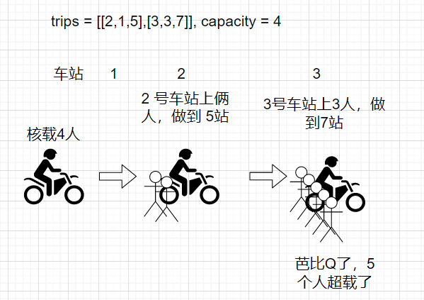
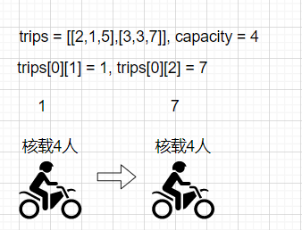
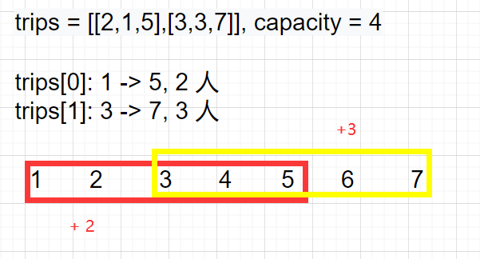

# leetcode_1094. 拼车

题目链接: [1094. 拼车](https://leetcode-cn.com/problems/car-pooling/)

假如你是一个哈啰单车顺风车司机，面对行进路上不断有行人上车，你必须考虑是否能够搭乘（伪题目）乘客

# 题目

假设你是一位顺风车司机，车上最初有 `capacity`  个空座位可以用来载客。由于道路的限制，车**只能**向一个方向行驶（也就是说，**不允许掉头或改变方向**，你可以将其想象为一个向量）。

这儿有一份乘客行程计划表 `trips[][]`，其中 `trips[i] = [num_passengers, start_location, end_location]`  包含了第 `i` 组乘客的行程信息：

- 必须接送的乘客数量；
- 乘客的上车地点；
- 以及乘客的下车地点。

这些给出的地点位置是从你的**初始**出发位置向前行驶到这些地点所需的距离（它们一定在你的行驶方向上）。

请你根据给出的行程计划表和车子的座位数，来判断你的车是否可以顺利完成接送所有乘客的任务（当且仅当你可以在所有给定的行程中接送所有乘客时，返回 `true`，否则请返回 `false`）。

## 示例 1

```
输入：trips = [[2,1,5],[3,3,7]], capacity = 4
输出：false
```

## 示例 2

```
输入：trips = [[2,1,5],[3,3,7]], capacity = 5
输出：true
```

## 示例 3

```
输入：trips = [[2,1,5],[3,5,7]], capacity = 3
输出：true
```

## 示例 4

```
输入：trips = [[3,2,7],[3,7,9],[8,3,9]], capacity = 11
输出：true
```

## 提示

- 你可以假设乘客会自觉遵守 “**先下后上**” 的良好素质
- `trips.length <= 1000`
- `trips[i].length == 3`
- `1 <= trips[i][0] <= 100`
- `0 <= trips[i][1] < trips[i][2] <= 1000`
- `1 <= capacity <= 100000`

## 代码模板

```js
/**
 * @param {number[][]} trips
 * @param {number} capacity
 * @return {boolean}
 */
var carPooling = function (trips, capacity) {};
```

# 解法

这道题目的意思完全可以用下面这个图来解释，系好安全带，准备上车！



所以机智的你可能已经猜到这道题要怎么下手了，我把每一个车站的人都算一遍，如果这个车站的人数超了，说明不能完成接送所有乘客的任务，那么怎么知道有多少个车站呢？请注意题目里面的一个提示

**这些给出的地点位置是从你的初始出发位置向前行驶到这些地点所需的距离（它们一定在你的行驶方向上）**

也就是说，我的车必然会经过 `trips` 里面**上车地点**最小的车站，**下车地点**最大的车站



所以是不是要像下面这样子做呢？

```js
let min = Number.MAX_SAFE_INTEGER,
  max = Number.MIN_SAFE_INTEGER;
for (let i = 0; i < trips.length; i++) {
  if (trips[i][1] < min) {
    min = trips[i][1];
  }
  if (trips[i][2] > max) {
    max = trips[i][1];
  }
}
return [min, max];
```

这样格局就小了，我内存战士从来不担心没内存和预设内存，睁大眼看了提示后发现

```
0 <= trips[i][1] < trips[i][2] <= 1000
```

这车站最多也多不过 `1000` 站，那我格局大一点，我预设 `2000` 个车站的数组，记录每一个站上我滴摩托上的人数

```js
// 默认每个车站没有人要接送
const station = new Array(2000).fill(0);
```

## 解法一

那么第一个暴力解法，万事通 `for` 循环就出来了

```js
var carPooling = function (trips, capacity) {
  const station = new Array(2000).fill(0);
  for (let i = 0; i < trips.length; i++) {
    const start = trips[i][1];
    const end = trips[i][2];
    for (let j = start; j < end; j++) {
      station[j] += trips[i][0];
    }
    if (station[i] > capacity) {
      return false;
    }
  }
  return true;
};
```

说实话我是万万没想到，这个时间复杂度为 `O(n*m)` 的算法竟然也过了，看来是道水题


不过我们不能只是通过就完事了，其实这个算法还有这优化的空间，仔细看上面两个循环中的第二个循环

```js
for (let j = start; j < end; j++) {
  station[j] += trips[i][0];
}
```

它的主要目的就是一个累加的过程，累加的对象是我们的车站，对于 `trips` 中的每一个元素跨过的车站区间都需要去累加，那如果有多个 `trips` 元素具有重叠部分，实际上就是重复操作了，如下



而有一种算法可以帮助我们解决这个问题，将时间复杂度压缩在 `O(1)`，这个算法就是差分数组，差分数组能够将我们需要加的值**只加一次**，并将所加的值层层递进到数组尾部

简单概述一下，差分数组的概念

```
diff[i] = num[i] - num[i-1]
diff[0] = num[0]

原数组 num    [1,2,3,4,5]
差分数组 diff [1,1,1,1,1]

将数组索引 1 -> 3 的元素加 3，可以直接在 diff[1] = diff[1] + 3, diff[3] = diff[3] - 3

差分数组 diff [1,4,1,-2,1]
将差分数组还原可得 num[1,5,6,7,5];
```

它的生成算法和还原算法如下

```js
// 生成算法
const num = [1, 2, 3, 4, 5];
const diff = new Array(num.length).fill(0);

// 注意：diff[0] 是和 num 相同的
diff[0] = num[0];

for (let i = 1; i < num.length; i++) {
  diff[i] = num[i] - num[i - 1];
}

// 还原算法
// 原数组   num  = [1,2,3,4,5]
// 差分数组 diff = [1,4,1,1,1]
const res = new Array(diff.length).fill(0);
res[0] = diff[0]; // diff[0] === num[0]

// 此时 diff[1] = num[1] - num[0] + 3
// 而 diff[i] = num[i] - num[i-1]
for (let i = 1; i < num.length; i++) {
  res[i] = res[i - 1] + diff[i];
  // 当执行到 i = 1 时
  // res[1] = res[0] + diff[1] = num[0] + num[1] - num[0] + 3 = num[1] + 3
  // 当执行到 i = 2 时
  // res[2] = res[1] + diff[2] = num[1] + 3 + num[2] - num[1] = num[2] + 3
}
```

所以依靠**差分数组**我们可以消去一个 `for` 循环，让一个区间的操作变成两次操作，使得时间复杂度达到 `O(n)`

**差分数组**的解法如下

```js
var carPooling = function (trips, capacity) {
  // 车站初始值全为 0，差分数组和车站初始数组相同
  const station = new Array(2000).fill(0);
  for (let i = 0; i < trips.length; i++) {
    const start = trips[i][1];
    const end = trips[i][2];
    station[start] += trips[i][0];
    station[end] -= trips[i][0];
  }
  // 将差分数组还原
  for (let i = 1; i < station.length; i++) {
    station[i] += station[i - 1];
    if (station[i] > capacity) {
      return false;
    }
  }
  // 注意不要漏掉了差分数组索引为 0 的校验
  if (station[0] > capacity) {
    return false;
  }
  return true;
};
```

# 总结

我们真的需要**差分数组**吗？单靠 `leetcode` 上提交的性能校验看，优化后的算法如下


其实和暴力法区别不大，有些情况下，差分数组可能还要弱于暴力法，因为你可能需要生成**差分数组**和还原**差分数组**，这两者的时间复杂度都是 `O(n)`，再加上遍历车站也要 `O(n)` 所以，差分数组解法的时间复杂度至少要 `O(3*n)`，而暴力解法只要乘客平均搭乘车站区间小于 `3`，暴力法的时间都会小于差分数组，所以算法还是要考虑场景的，暴力穷举也有春天
