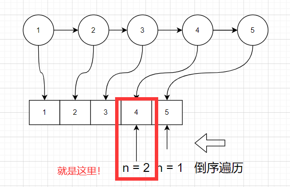

# leetcode_19. 删除链表的倒数第 N 个结点

题目链接: [19. 删除链表的倒数第 N 个结点](https://leetcode-cn.com/problems/remove-nth-node-from-end-of-list/)

# 题目

给你一个链表，删除链表的倒数第 `n` 个结点，并且返回链表的头结点。

## 示例 1


```
输入：head = [1,2,3,4,5], n = 2
输出：[1,2,3,5]
```

## 示例 2

```
输入：head = [1], n = 1
输出：[]
```

## 示例 3

```
输入：head = [1,2], n = 1
输出：[1]
```

## 提示

- 链表中结点的数目为 `sz`
- `1 <= sz <= 30`
- `0 <= Node.val <= 100`
- `1 <= n <= sz`

**进阶：**你能尝试使用一趟扫描实现吗？

## 代码模板

```js
/**
 * @param {ListNode} head
 * @param {number} n
 * @return {ListNode}
 */
var removeNthFromEnd = function (head, n) {};
```

## 题解

又到了一题喜闻乐见的链表题，希望大家面试的时候都能够遇到反转链表而不是 hard 题，回到这道题的身上，删除链表的倒数第 `N` 个结点，像 `JS` 里面可以使用 `splice` 这种 `API` 去删除数组中的元素，那么这道题里面可以尝试着将链表转换为数组，然后用数组的 `API` 去解决这个问题，其过程如下



这里用到了栈的思想，先遍历链表压栈，再根据 `n` 出栈（其实不用直接用索引就行了，我画图的时候还没想到），达到删除节点的目的，其代码如下

## 解法一

```js
var removeNthFromEnd = function (head, n) {
  let node = head;
  const nodes = [];
  while (node !== null) {
    nodes.push(node);
    node = node.next;
  }
  if (n === nodes.length) {
    return nodes[0].next;
  }
  const prev = nodes[nodes.length - n - 1];
  const curr = nodes[nodes.length - n];
  prev.next = curr.next;
  return head;
};
```

这种很好理解，但是要注意一些小细节问题，比如 `nodes.length - n - 1 <= 0` 也就是被删除的节点是第 `0` 个节点，即头节点的时候，应该直接返回下一个节点，不知道你们有没有注意到，当被删除节点是头节点，上面的代码并没有做删除操作，但是依然通过了，说明 `leetcode` 并不要求你原地 `TP`，而是根据你的返回值判断的（可能有点废话了），严谨一点的做法可以像下面这样

```js
if (n === nodes.length) {
  const res = nodes[0].next;
  nodes[0].next = null;
  return res;
}
```


但这样的做法其实算是利用 `JS` 的语言特性，沾了光，在 `JS` 中我们模拟了一个栈后，还可以继续使用数组的索引特性，可以说是顺序存储的栈了，如果没有索引的特性就需要**出栈计数**直到找到满足条件的节点，这样我们就需要遍历 `2` 次数组，时间复杂度就来到了 `O(2*n)`，现在压力来到了栈这边

有些语言的数组必须初始化长度才能用，那么发散一下思维，这个时候应该用什么来解决这个问题呢？

## 解法二

链表的题目，使用它指针的特性其实要更加原汁原味（奥力给干了），这道题其实还可以使用**快慢指针**去解决，让一个指针先走 `n` 步，然后两个指针再一步步的走，其过程如下


这样我们两个指针只走一遍就能够成功删除掉对应的节点，解法如下

```js
var removeNthFromEnd = function (head, n) {
  let slow = head,
    fast = head;
  while (n > 0) {
    fast = fast.next;
    n--;
  }
  if (fast === null) {
    return head.next;
  }
  while (fast.next !== null) {
    slow = slow.next;
    fast = fast.next;
  }
  slow.next = slow.next.next;
  return head;
};
```

快慢指针也就是双指针，这种解法也需要注意 `n` 等于链表长度的问题，而这种解法也是满足了进阶的终极目标**只使用一趟扫描**实现

## 总结

`JS` 的许多特性可以帮助我们在某些题上快速解决题目，少花几个脑细胞，但是链表用双指针去解决是可以面对绝大多数场景的，是比较贴近**伪代码**的一种，不需要调库，尤其像我上面的第一种解法，用 `C` 语言写指不定要调几个库呢，同时 `JS` 本身又没有链表的数据结构，做链表本地复现还得自己实现一个，算是各有优势吧
