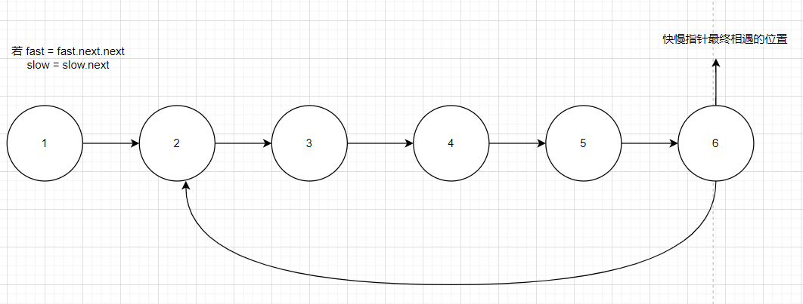
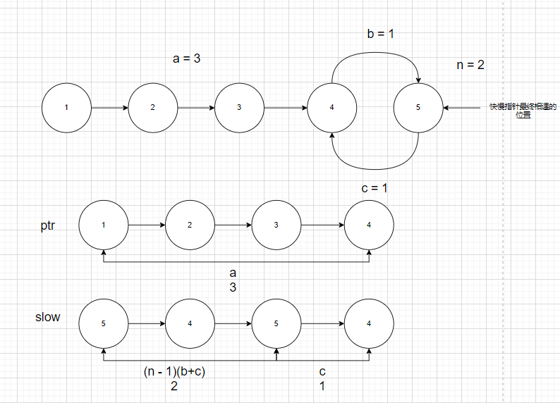

**141. 环形链表** 和 **142. 环形链表 II** 这两道题配图，示例，提示全都一样，但是一道是中等一道是简单，究竟是什么细节问题让题目的难度上升了一个数量级？

上面两道题其实只有一个地方不一样，就是要求返回值的问题，**142. 环形链表 II**要求返回**环**存在的位置，而**141. 环形链表**只要求返回存在的 `boolean` 值，就是因为返回**环**存在的位置导致两道题的解法有一些不同

**141. 环形链表** 采用快慢指针解决问题，一次循环中，快指针走两步，而慢指针走一步，所以有环肯定会相遇，因此相遇后一定能够判断是否是有环，但是两个指针相遇的地点不一定是环的位置，这也是**142. 环形链表 II**中故意误导的一点，示例中并没有给出这种情况

