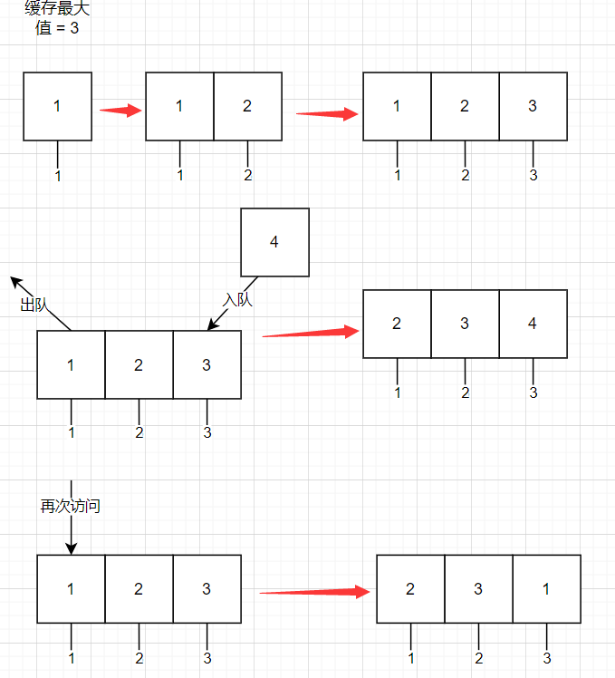
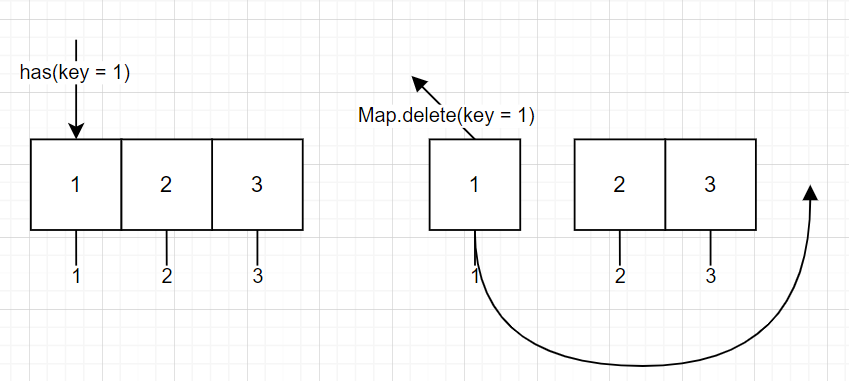
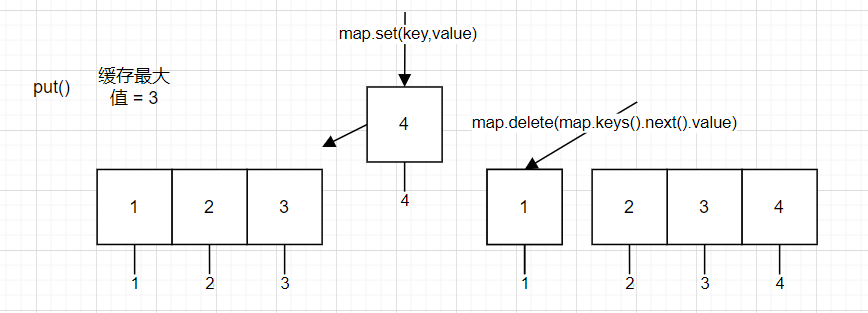

# KeepAlive 中的数据结构 LRU 缓存

前端的面试有时候会问 `KeepAlive`，而 `KeepAlive` 中运用到了 `LRU` 缓存，是它的原理之一，`LRU` 在 `leetcode` 中也对应了 `146. LRU 缓存`，这篇文章主要讲解这道题目

题目链接: [146. LRU 缓存](https://leetcode-cn.com/problems/lru-cache/)

# 一、题目描述：

请你设计并实现一个满足 `LRU` (最近最少使用) 缓存约束的数据结构。

实现 `LRUCache` 类：

- `LRUCache(int capacity)` 以正整数作为容量 `capacity` 初始化 `LRU` 缓存
- `int get(int key)` 如果关键字 key 存在于缓存中，则返回关键字的值，否则返回 `-1` 。
- `void put(int key, int value)`  如果关键字  `key` 已经存在，则变更其数据值  `value` ；如果不存在，则向缓存中插入该组  `key-value` 。如果插入操作导致关键字数量超过  `capacity` ，则应该 逐出 最久未使用的关键字。

函数 `get` 和 `put` 必须以 `O(1)` 的平均时间复杂度运行。

## 示例：

```
输入
["LRUCache", "put", "put", "get", "put", "get", "put", "get", "get", "get"]
[[2], [1, 1], [2, 2], [1], [3, 3], [2], [4, 4], [1], [3], [4]]
输出
[null, null, null, 1, null, -1, null, -1, 3, 4]

解释
LRUCache lRUCache = new LRUCache(2);
lRUCache.put(1, 1); // 缓存是 {1=1}
lRUCache.put(2, 2); // 缓存是 {1=1, 2=2}
lRUCache.get(1);    // 返回 1
lRUCache.put(3, 3); // 该操作会使得关键字 2 作废，缓存是 {1=1, 3=3}
lRUCache.get(2);    // 返回 -1 (未找到)
lRUCache.put(4, 4); // 该操作会使得关键字 1 作废，缓存是 {4=4, 3=3}
lRUCache.get(1);    // 返回 -1 (未找到)
lRUCache.get(3);    // 返回 3
lRUCache.get(4);    // 返回 4
```

## 提示：

- `1 <= capacity <= 3000`
- `0 <= key <= 10000`
- `0 <= value <= 105`
- 最多调用 `2 * 105` 次 `get` 和 `put`

## 题目模板

```js
/**
 * @param {number} capacity
 */
var LRUCache = function (capacity) {};

/**
 * @param {number} key
 * @return {number}
 */
LRUCache.prototype.get = function (key) {};

/**
 * @param {number} key
 * @param {number} value
 * @return {void}
 */
LRUCache.prototype.put = function (key, value) {};
```

# 二、思路分析：

学过操作系统的同学可能知道 `LRU` 缓存，是用在主存里面的一个页面调度算法，也可以说是它是一种数据结构，当时我还学了最佳置换 `OPT`、先进先出 `FIFO`、最不常用 `LFU`、时钟 `CLOCK` 几种页面调度算法，回到 `LRU`，它的全名叫做 `LRU(least recently used)` 最近最少使用页面调度算法，之前我舍友说 `LRU` 是用栈来实现的，但其实它的特性更像队列，用一个图来解释一下



可以看到

1. 缓存里面不存在的并且要进入缓存的就会把最早进入缓存的页面删除
2. 重新访问缓存中的页面会重新调到队列末尾，视为最新

它的思路很简单，但是 `get` 和 `put` 也就是获取值和入队需要 `O(1)`，然后上面的那个图也可以知道这个 `LRU` 是存在删除操作的，也就是在 `put` 当中存在 `delete` 也要实现 `O(1)`，这个就比较麻烦，`O(1)` 的增删查改以我目前的经验来说，只有特殊的数组和哈希表能够做到，所以这道题的思路肯定是要围绕数组或者哈希来展开

数组实现增删查改有点麻烦，而且是要在一些特殊情况，`LRU` 就不是这种特殊情况，因此需要使用 `JS ES6` 的新特性 `JS` 中的哈希 `Map` 来完成 `LRU` 的实现

复习一下 `LRU` 的几个 `API`

1. `Map.prototype.has(key: string): boolean`：判断 `Map` 中是否存在这个 `key`，本题中用于判断新插入的值是否存在缓存
2. `Map.prototype.delete(key: string): boolean`：删除 `Map` 中这个 `key-value` 键值对，本题中用于超过缓存限制和再次访问时调到队尾
3. `Map.prototype.delete(key: string, value: any): boolean`：设置缓存值
4. `Map.prototype.keys(): IterableIterator<any>`：用于获取队列中的第一个值

代码可以说是信手捏来啊，看下图





需要注意的就是 `Map.prototype.keys()` 返回的是一个 `Iterator`，要使用 `.next().value` 的语法获取值

# 三、AC 代码：

```js
var LRUCache = function (capacity) {
  this.max = capacity;
  this.map = new Map();
};

LRUCache.prototype.get = function (key) {
  const { map } = this;
  if (map.has(key)) {
    const res = map.get(key);
    map.delete(key);
    map.set(key, res);
    return res;
  } else {
    return -1;
  }
};

LRUCache.prototype.put = function (key, value) {
  const { map, max } = this;
  if (map.has(key)) {
    map.delete(key);
  }
  map.set(key, value);
  if (map.size > max) {
    map.delete(map.keys().next().value);
  }
};
```

# 四、总结：

`LRU` 和哈希有关，更是和 `LinkedHashMap` 有关，初始的哈希表是一个各个元素间没有顺序的一个数组，`LinkedHashMap` 给初始的哈希表加上了顺序，是哈希表与双向链表两种数据结构的结合题，哈希表的插入和查找时间复杂度都是为 `O(1)`，而双向链表的删除是 `O(1)` 而且有顺序，因此能够解决 `LRU` 的问题，而 `JS` 的 `Map` 本身就是能够记住键的原始插入顺序，因此算是粘了语言特性的光，感兴趣的可以去看一下双向链表的实现，用双向链表加 `Map` 去重新解决这道题

最后也是点一下题，就是 `KeepAlive` 这个 `Vue` 使用的缓存组件真的和 `LRU` 有关吗？让我们看一下它的一个源码实现

```ts
const KeepAliveImpl: ComponentOptions = {
  name: `KeepAlive`,
  // ...
  setup(props: KeepAliveProps, { slots }: SetupContext) {
    // 初始化缓存和键值
    const cache: Cache = new Map();
    const keys: Keys = new Set();
    let current: VNode | null = null;
    // ...
    return () => {
      // ...
      const key = vnode.key == null ? comp : vnode.key;
      const cachedVNode = cache.get(key);
      // ...
      pendingCacheKey = key;

      if (cachedVNode) {
        keys.delete(key);
        keys.add(key);
      } else {
        keys.add(key);
        if (max && keys.size > parseInt(max as string, 10)) {
          pruneCacheEntry(keys.values().next().value);
        }
      }
      // ...
    };
  },
};
```

上面就是 `KeepAlive` 初始化部分的源码（`Vue3`），可以看到和我们 `LRU` 中的 `put` 可以说是一摸一样
