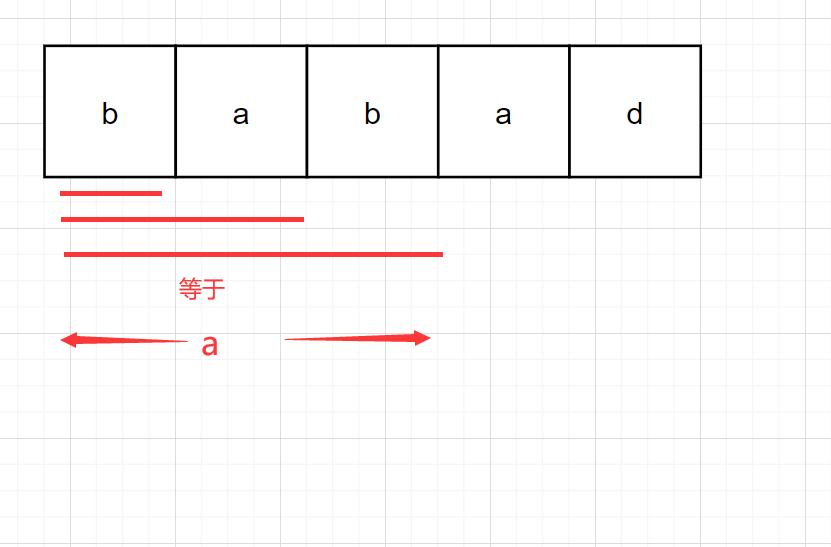
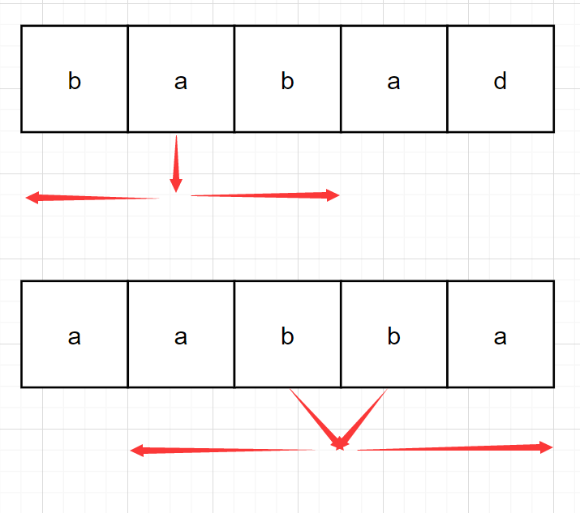
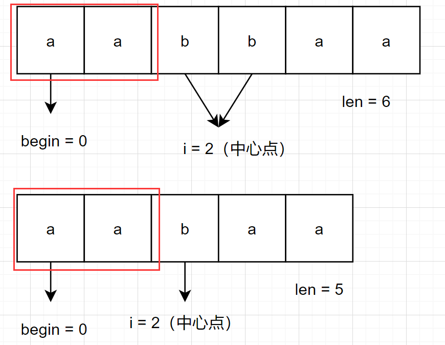

# leetcode_5. 最长回文子串

题目链接: [5. 最长回文子串](https://leetcode-cn.com/problems/longest-palindromic-substring/)

# 一、题目描述：

给你一个字符串 `s`，找到 `s` 中最长的回文子串。

## 示例 1：

```
输入：s = "babad"
输出："bab"
解释："aba" 同样是符合题意的答案。
示例 2：

输入：s = "cbbd"
输出："bb"
```

## 提示：

- `1 <= s.length <= 1000`
- `s` 仅由数字和英文字母组成

## 题目模板

```js
/**
 * @param {string} s
 * @return {string}
 */
var longestPalindrome = function (s) {};
```

# 二、思路分析：

又是这种只有寥寥几句的题目，这种题往往都是暗藏玄机，但像数组题目，没有什么是我 `for` 循环不敢碰一碰的，暴力穷举是提升做题幸福感的小技巧（`for` 循环再带我冲一次吧）

那要怎么个暴力法呢？首先判断回文字符串我们知道怎么做，然后求字符串全部子串我们知道怎么做，那么两者二加一不就可以解决这道题了？

1. 判断回文字符串

```js
const isPalindrome = (s) => {
  let left = 0,
    right = s.length - 1;
  while (left < right) {
    if (s.charAt(left) != s.charAt(right)) {
      return false;
    }
    left++;
    right--;
  }
  return true;
};
```

2. 求全组合

```js
const all = (s) => {
  for (let i = 0; i < s.length; i++) {
    for (let j = i; j < s.length; j++) {
      s.substring(i, j);
    }
  }
};
```

稍微改造一下就是熟悉的暴力解法

```js
var longestPalindrome = function (s) {
  const isPalindrome = (s, left, right) => {
    while (left < right) {
      if (s.charAt(left) != s.charAt(right)) {
        return false;
      }
      left++;
      right--;
    }
    return true;
  };
  let begin = 0,
    length = 1;
  for (let i = 0; i < s.length; i++) {
    for (let j = i; j < s.length; j++) {
      if (isPalindrome(s, i, j)) {
        if (j - i + 1 > length) {
          begin = i;
          length = j - i + 1;
        }
      }
    }
  }
  return s.substring(begin, begin + length);
};
```

这个算法的空间复杂度为 `O(1)` 因为只用了常数级的变量，比如 `begin, length`，而时间复杂度是 `O(n^3)`，首先两个 `for` 循环，然后判断回文字符串最坏的复杂度为 `i = 0, j = s.length - 1` 的情况为 `O(n)`，因此最坏的时间复杂度为 `O(n^3)`，通常这么高的时间复杂度往往只能在回溯系算法中能够存活，而这道**最长**回文子串很显不是属于回溯系算法题目，`for` 循环完败

所以算法肯定需要优化，怎么做呢？

我们枚举出来的子串，有很多是长度为 `1` 的子串，属于是子串中的子串，弟中弟了属于是，但我们的最终目的是找到最长子串，没必要把所有小的子串都枚举，因此可以每次只遍历**最长**，看下图



没必要判断 `b, ba, ab, bab` 是不是回文字符串然后相互比较最大值，我们只需要看以 `a` 为中心的最长回文字符串，这样就可以将 `O(n^2)` 的全排列变成 `O(n)`，因为我们只用遍历一次字符串

## 奇偶回文

根据上面的例子我们需要从一个‘点’去向左右两边扩散，看看以该‘点’为中心的最长回文字符串是什么，但是这个‘点’不一定是指单个字符串，可以是 `1` 个或 `2` 个，因为存在奇偶字符串，如下图所示



所以我们对一个字符串需要遍历一次，`n = 1` 的全排列，`n = 2` 的全排列，遍历次数为 `n + n - 1`，时间复杂度为 `O(n)`，最后的 `AC` 代码如下

# 三、AC 代码：

```js
var longestPalindrome = function (s) {
  // 以 l, r 为中心向外拓散
  // l === r || l + 1 === r
  const findPalindrome = (s, l, r) => {
    const len = s.length;
    while (l >= 0 && r < s.length && s.charAt(l) === s.charAt(r)) {
      l--;
      r++;
    }
    // 返回最长回文字符串的长度
    return r - l - 1;
  };
  let begin = 0,
    length = 1;
  for (let i = 0; i < s.length; i++) {
    const len1 = findPalindrome(s, i, i);
    const len2 = findPalindrome(s, i, i + 1);
    const len = Math.max(len1, len2);
    if (len > length) {
      begin = i - Math.floor((len - 1) / 2);
      length = len;
    }
  }
  return s.substring(begin, begin + length);
};
```

上面的代码核心思路已经讲过了，唯一可能需要解释的就是 `begin` 的计算，`begin` 就是等于**中心点**减去回文‘半径’，如下图所示



你会发现无论是奇数回文还是偶数回文，都能够求出正确的回文半径

```js
begin = i - Math.floor((len - 1) / 2);
length = len;
```

# 四、总结：

这道题还可以使用动态规划的思路去解释，更有牛的不行的 `Manacher` 算法，能将时间复杂度降到 `O(n)`，但我这里就不多介绍了，感兴趣的自己去查阅吧
