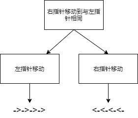
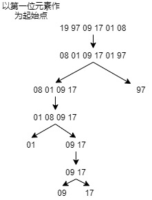

# 快速排序和递归之间的关系

面向关键字 SEO，快速排序，前端，JS，JavaScript，javascript，算法，递归

最近看了 labuladong 的[手把手带你刷二叉树（纲领篇）](https://labuladong.gitee.io/algo/2/17/20/)对快速排序有了新的思路

文章的主角，快速排序的两个难点，排序逻辑和递归调用，前几天面试字节的时候排序逻辑只写了一半，而递归调用没写出来，面 CVTE 的时候递归调用写出来了，排序逻辑没弄出来，所以本篇文章会从两个点来讲解快速排序

1. 排序逻辑
2. 递归调用（这里与 labuladong 的算法小抄相关）

# 排序逻辑

详细逻辑请看，[快速排序 - 秒懂算法](https://www.bilibili.com/video/BV1at411T75o?from=search&seid=14072687460489987052&spm_id_from=333.337.0.0)

```js
// 具体代码
// nums 是待排序数组
let left = 0;
let right = nums.length - 1;
const pivot = nums[0];
while (left < right) {
  while (left < right && nums[right] >= pivot) {
    right = right - 1;
  }
  nums[left] = nums[right];
  while (left < right && nums[left] <= pivot) {
    left = left + 1;
  }
  nums[right] = nums[left];
}
```

看来上面的视频你应该知道，排序逻辑主要是双指针，这里面双指针的难点在于，怎样`移动`的这个过程在两个指针中切换（我之前就是不会这个）

其实这个双指针的移动不要纠结与`在一个循环中完成`，而是想成拆分，每一次排序中，涉及两个操作，右指针移动到与左指针相同，左指针移动，右指针移动，而这里就是三个循环



## 细节问题

1. 需不需要考虑小于等于和大于等于的情况？


仔细看，排序逻辑中，外部循环是要满足 left >= right 才能够退出，那么有没有可能，循环内部的 left 和 right 一直没有移动呢？因为我们内部的两个循环满足条件其实也满`苛刻`，举一个例子，如果左右指针的循环是下面这样的

```js
while (left < right && nums[right] > pivot) {
  right = right - 1;
}
nums[left] = nums[right];
while (left < right && nums[left] < pivot) {
  left = left + 1;
}
nums[right] = nums[left];
```

对于下面这个例子，left 和 right 将不会移动

```js
// 下面这个函数在没有大于等于的情况下会导致死循环
const arr = [0, 1, 1, 2, 0];
```

2. 为什么不用 swap 而是可以直接双指针之间直接赋值，不会引起排序错乱吗？

快速排序中要视你的基准值来决定`左右指针`循环内部两个循环的位置，左指针移动循环和右指针移动循环，如果基准值以右边为准，则是先右后左，反之则是，先左后右，如果将循环内部的代码在补充的充分一些，就能理解的更充分一些。

```js
let left = 0;
let right = nums.length - 1;
const pivot = nums[0];

//补充
// 此时 nums[0] 的值已经被 pivot 保留，所以等同与未赋值
nums[0] = undefined;
//
while (left < right) {
  while (left < right && nums[right] >= pivot) {
    right = right - 1;
  }
  // 这就是为什么右指针一开始移动的时候就能够
  // 赋值给 nums[left], 因为 nums[left] 相当于 undefined
  nums[left] = nums[right];
  // 补充
  // 同理 nums[right] 的 `值` 被 nums[left] `保留`了
  nums[right] = undefined;
  //
  while (left < right && nums[left] <= pivot) {
    left = left + 1;
  }
  // 同 nums[left] = nums[right];
  nums[right] = nums[left];
}
```

3. 为什么要在左右指针循环中加入 left < right 的条件？

```js
let left = 0;
let right = nums.length - 1;
const pivot = nums[0];
while (left < right) {
  while (left < right && nums[right] >= pivot) {
    right = right - 1;
  }
  nums[left] = nums[right];
  while (left < right && nums[left] <= pivot) {
    left = left + 1;
  }
  nums[right] = nums[left];
}
```

这是因为可能存在，左指针或者右指针存在一直比基准值小或者大的情况，这样某次循环中，不加以限制的话，左指针或者右指针可能直接就窜到了数组头部或者数组尾部，左指针可能会右指针的右边，右指针同理，注意，左右指针代表基准值的边界，所以最多移动到与左右指针相同的位置，如果此时，左或者右指针没有动过就会导致 left = nums.length 或者 right = -1;

```js
// 以 arr[0] 为基准值
// 不加以限制的话，右指针会直接窜到数组头部
// 会出现 right < left 的情况
let arr = [1, 2, 3, 4, 5];
```

# 递归调用

_递归部分，为什么是在排序逻辑之后？_

## 前序位置

首先，快速排序的递归是要传递左右两部分排过序的值，而函数传递进来的参数是上一层未经排过序的值，所以我们需要在前序位置处理参数，然后在进行递归调用

以 `[19,97,09,17,01,08]` 为例



## 后序位置

**后序位置**可以获取到子树通过函数返回值传递回来的数据，所以左右子树返回的排好序的数组需要在这个位置进行合并，然后返回给`上一级`

注：后序位置概念在这篇文章中有介绍，[手把手带你刷二叉树（纲领篇）- labuladong](https://labuladong.gitee.io/algo/2/17/20/)

## 代码

我自己写的，后面发现内含动态规划思想，算不算是动态规划已经深入我心？这个算法从代码看从每个子问题的解得到答案然后得到最优解，但实际写出来是由自顶向下然后转变成自底向上。但是也存在缺点，就是很浪费内存，因为每次递归都要消耗创建新的数组，后面优化后，直接原地修改数组或者拷贝一个新的数组原地修改

```js
var sortArray = function (nums) {
  if (nums.length <= 1) {
    return nums;
  }
  let left = 0;
  let right = nums.length - 1;
  const pivot = nums[0];
  while (left < right) {
    while (left < right && nums[right] > pivot) {
      right = right - 1;
    }
    nums[left] = nums[right];
    while (left < right && nums[left] < pivot) {
      left = left + 1;
    }
    nums[right] = nums[left];
  }
  nums[left] = pivot;
  return [
    ...sortArray(nums.slice(0, left)),
    pivot,
    ...sortArray(nums.slice(left + 1)),
  ];
};
```

网上找到一个 JS 快排例子，写的很好，后面我继续看的时候发现这里其实用到了回溯的思想，如果把参数抽取出来，将内部数组的改动视为一种引用修改，就非常符合回溯的特点，但能力有限，无法还原成回溯的样子

又或许是因为`数组式`的递归要想和二叉树链表类型式的递归相比，`数组式`的递归必须同时拿捏数组本身，左指针和右指针

上述两种想法都是作者随便**乱写**的，无需理会

```js
const quickSort = (array) => {
  const sort = (arr, left = 0, right = arr.length - 1) => {
    if (left >= right) {
      //如果左边的索引大于等于右边的索引说明整理完毕
      return;
    }
    let i = left;
    let j = right;
    const baseVal = arr[j]; // 取无序数组最后一个数为基准值
    while (i < j) {
      //把所有比基准值小的数放在左边大的数放在右边
      while (i < j && arr[i] <= baseVal) {
        //找到一个比基准值大的数交换
        i++;
      }
      arr[j] = arr[i]; // 将较大的值放在右边如果没有比基准值大的数就是将自己赋值给自己（i 等于 j）
      while (j > i && arr[j] >= baseVal) {
        //找到一个比基准值小的数交换
        j--;
      }
      arr[i] = arr[j]; // 将较小的值放在左边如果没有找到比基准值小的数就是将自己赋值给自己（i 等于 j）
    }
    arr[j] = baseVal; // 将基准值放至中央位置完成一次循环（这时候 j 等于 i ）
    sort(arr, left, j - 1); // 将左边的无序数组重复上面的操作
    sort(arr, j + 1, right); // 将右边的无序数组重复上面的操作
  };
  const newArr = array.concat(); // 为了保证这个函数是纯函数拷贝一次数组
  sort(newArr);
  return newArr;
};
```

其实可以不需要返回数组，这样浪费了空间，直接传递索引就行，下面是百度百科找到的一个答案

# 总结

可能有人看了想骂我，你根本没有把快速排序的精髓分治讲出来，快速排序为什么要这么分治为什么要这么做你都没有详细讲

其实是因为文章是想讲快排和递归的关系，对于快速排序的内在逻辑，我也不想过多赘述，网上一大把，不过 labuladong 好像会对快排类似的题目也有相应的文章，后面看的时候可能会再写一篇文章讲一下。

# 参考资料

1. [手把手带你刷二叉树（纲领篇）- labuladong](https://labuladong.gitee.io/algo/2/17/20/)
2. [快速排序 - 秒懂算法](https://www.bilibili.com/video/BV1at411T75o?from=search&seid=14072687460489987052&spm_id_from=333.337.0.0)
