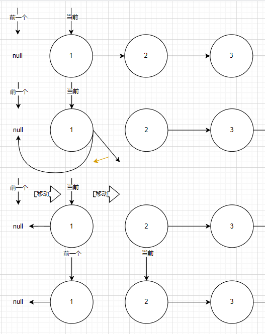
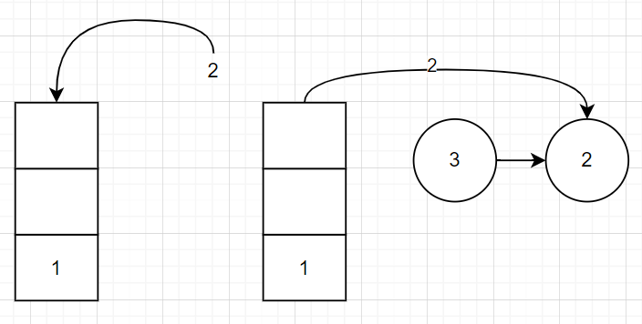
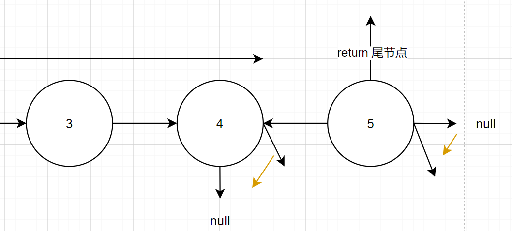

# leetcode\_今天面试官高兴，给你面一道反转链表

题目链接: [206. 反转链表](https://leetcode-cn.com/problems/reverse-linked-list/)

这道题我相信经常刷脉脉的人应该很熟悉，可以说是脉脉的程序员无人不晓的一种程度，那它到底是表达一个什么意思呢？首先这是一个简单题，然后通常用来表示面试官想要候选人时会出的算法题，这道题通常会和 `leetcode` 的另一道题做配，就是[接雨水](https://leetcode-cn.com/problems/trapping-rain-water/)，通常做组合为，**想要你就出反转链表，不想要你就出接雨水**，现在还出现了一些衍生版本，将接雨水修改成 `leetcode k` 系题目，比如[25. K 个一组翻转链表](https://leetcode-cn.com/problems/reverse-nodes-in-k-group)，[23. 合并 K 个升序链表](https://leetcode-cn.com/problems/merge-k-sorted-lists) 等等，但是我们的反转链表的地位还是不变的，所以接下来就让我们看一下这道反转链表

# 一、题目描述：

给你单链表的头节点 `head`，请你反转链表，并返回反转后的链表。

## 示例 1：


```
输入：head = [1,2,3,4,5]
输出：[5,4,3,2,1]
```

## 示例 2：


```
输入：head = [1,2]
输出：[2,1]
```

## 示例 3：

```
输入：head = []
输出：[]
```

## 提示：

- 链表中节点的数目范围是 `[0, 5000]`
- `-5000 <= Node.val <= 5000`

## 题目模板

```js
/**
 * Definition for singly-linked list.
 * function ListNode(val, next) {
 *     this.val = (val===undefined ? 0 : val)
 *     this.next = (next===undefined ? null : next)
 * }
 */
/**
 * @param {ListNode} head
 * @return {ListNode}
 */
var reverseList = function (head) {};
```

# 二、思路分析：

这道题其实有两种思路，我们先买个关子，先将第一种

## 迭代

迭代的思路就是利用双指针，一个指向前一个节点，一个指向当前节点，然后两个节点齐头并进，当前节点利用指向前一个节点的指指针修改当前节点的指向

这道题的迭代思路还是很好理解的，我画个图大家应该就能知道其中的原理了



看懂上面节点两两之间的原理后就可以推广到整个链表，我们唯一需要考虑的就是边界值，`pre` 节点也就是指向前一个节点的指针初值为 `null` 因为反转链表前的 head 节点就是反转后的尾节点，而当 `cur` 节点 `next` 为 `null` 时就退出循环，`AC` 代码如下

```js
var reverseList = function (head) {
  let pre = null,
    cur = head;
  while (cur !== null) {
    const nextNode = cur.next;
    cur.next = pre;
    pre = cur;
    cur = nextNode;
  }
  return pre;
};
```

## 递归

面试时写递归的解法可能没有迭代的好，有可能还会让你改写成迭代，这在写树的题目可能会发生，但是这道题比较特殊，这道题的递归反而没有迭代那么容易想到，也就是递归难一点，这道题的递归也叫尾递归

我先不上递归，我用另一种方式引出递归，如果我将整个链表压入栈中，然后再依次弹出并建立连接，不也能够完成反转链表的操作？



这其实也反应了部分尾递归的思路

我先跳到链表尾部，然后我从尾节点开始去改变指针指向，每一次递归我都把尾节点往上传，过程如下



`AC` 代码如下

# 三、AC 代码：

```js
var reverseList = function (head) {
  if (head === null || head.next === null) {
    return head;
  }
  const lastHead = reverseList(head.next);
  head.next.next = head;
  head.next = null;
  return lastHead;
};
```

# 四、总结：

反转链表的尾递归非常简洁，有点动态规划的意思，一层层推进返回尾节点，但是算法还是有用就行，纠结于写迭代还是尾递归我个人觉得有点像是鲁迅讽刺茴字的几种写法