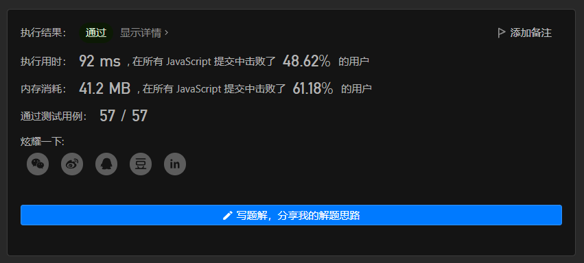
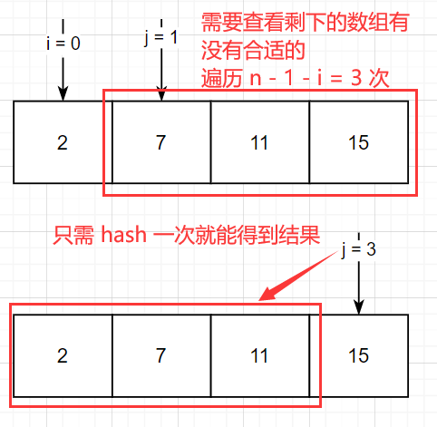
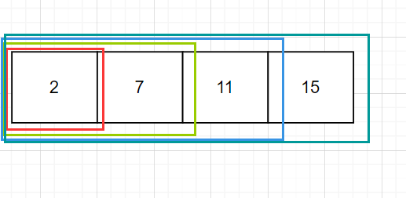

# leetcode\_今天面试官高兴，给你面一道 twoSum

题目链接: [1. 两数之和](https://leetcode-cn.com/problems/two-sum/)

上一篇文章我介绍一道非常多人熟悉的题目就是反转链表，最近反转链表的位置似乎有些松动，在某脉 `APP` 上形容面试官想要给你过面试的算法题逐渐从反转链表变成 `twoSum`，也许是 `twoSum` 比较好打？然后这道题也是 `leetcode` 的第一道题，非常经典，所以这篇文章就简单的来讲一下这道题的解法

# 一、题目描述：

给定一个整数数组 `nums`  和一个整数目标值 `target`，请你在该数组中找出**和为目标值** `target`  的那 **两个** 整数，并返回它们的数组下标。

你可以假设每种输入只会对应一个答案。但是，数组中同一个元素在答案里不能重复出现。

你可以按任意顺序返回答案。

## 示例 1：

```
输入：nums = [2,7,11,15], target = 9
输出：[0,1]
解释：因为 nums[0] + nums[1] == 9 ，返回 [0, 1] 。
```

## 示例 2：

```
输入：nums = [3,2,4], target = 6
输出：[1,2]
```

## 示例 3：

```
输入：nums = [3,3], target = 6
输出：[0,1]
```

## 提示：

- `2 <= nums.length <= 10^4`
- `-10^9 <= nums[i] <= 10^9`
- `-10^9 <= target <= 10^9`
- **只会存在一个有效答案**

**进阶：**你可以想出一个时间复杂度小于 `O(n2)` 的算法吗？

## 题目模板

```js
/**
 * @param {number[]} nums
 * @param {number} target
 * @return {number[]}
 */
var twoSum = function (nums, target) {};
```

# 二、思路分析：

题目给出一个 `target` 让你在数组里面找到两个和为 `target` 的元素，其实这个很简单，两‘套’ `for` 循环不就搞定了，拿捏住了，代码如下

## 暴力穷举

```js
var twoSum = function (nums, target) {
  for (let i = 0; i < nums.length; i++) {
    for (let j = i + 1; j < nums.length; j++) {
      if (nums[i] + nums[j] === target) {
        return [i, j];
      }
    }
  }
  return [-1, -1];
};
```

这个暴力穷举的算法时间复杂度为 `O(n^2)`，因为是两层循环，空间复杂度为 `O(1)`，因为我们只在返回的时候创建了变量

其实这个算法也是能过 `leetcode` 的



也许是因为第一题怕打击到 `leetcode` 新用户？这种暴力解法居然都过了


不过我们作为一个比较有追求的程序员还是需要去优化一下我们的代码，不能说为了过 `leetcode` 而刷 `leetcode`

那么如何去优化呢？可以去引入一种新的数据结构，就是 `hash`，也叫散列表，这是一种根据 `key` 获取 `value` 时间复杂度为 `O(1)` 的数据结构，总的来说，它很快，相当多的算法都可以使用 `hash` 去干掉一个 `for` 循环

相对于之前通过相加的方式得到 `target`，不妨换一个思路，也就是 `target - nums[j] = nums[i]`，所以在这道题的优化当中，我们可以使用 `target - currElement`，用 `target` 减去当前的数组元素判断是否已经存在与我们的 `hash` 当中，这种查找的速度是 `O(1)`

这究竟改变了什么呢？让我们看下面的图



为了避免漏掉每一个可能组成 `target` 的元素，我们每遍历到一个元素，就要和其他元素相加并与 `target` 比较，那么 `hash` 就不会漏掉吗？下图是 `hash` 的搜索范围



同样囊括了全部的组合，只不过它是‘反着来’的，但是由于它自身数据结构的特殊性，它可以做到 `O(1)` 的查找，而不需要 `O(n)` 的遍历来去避免可能漏掉元素

所以最后它的 `AC` 代码如下

# 三、AC 代码：

```js
var twoSum = function(nums, target) {
// <value,index>: 值是键，下标是索引
  let numsMap = new Map();
  for (let i = 0; i < nums.length; i++) {
    if (numsMap.has(target - nums[i])) {
      return [numsMap.get(target - nums[i]), i];
    }
    numsMap.set(nums[i], i);
  }
};
```

因为我这个是用 `JS` 写的，其实你用对象去模拟这个 `Map` 也不是不行，就是没有那么‘语义化’

# 四、总结：

像这种加法变减法的题目其实还有一些，比如 [560. 和为 K 的子数组](https://leetcode-cn.com/problems/subarray-sum-equals-k/)，也是聪明的穷举
