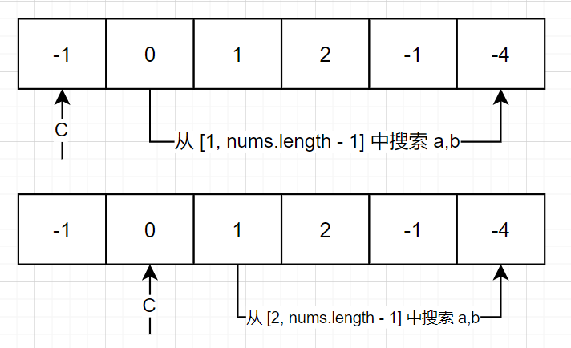
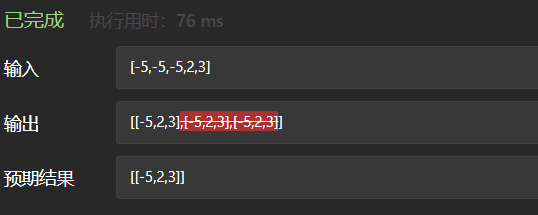
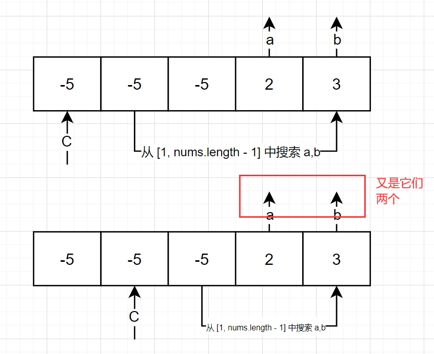

# leetcode_15. 三数之和

题目链接: [15. 三数之和](https://leetcode-cn.com/problems/3sum/)

据说华为的机试经常考这题，而且这道题也是扩展性极强的一道题，你可以看到[18. 四数之和](https://leetcode-cn.com/problems/4sum/)，或者人为修改的**五数之和**，**六数之和**，乃至**n 数之和**，也就是此类题目的终点 `nSum`

# 一、题目描述：

给你一个包含 `n` 个整数的数组 `nums`，判断 `nums`  中是否存在三个元素 `a`，`b`，`c`，使得 `a + b + c = 0`？请你找出所有和为 `0` 且不重复的三元组。

注意：答案中不可以包含重复的三元组。

## 示例 1：

```
输入：nums = [-1,0,1,2,-1,-4]
输出：[[-1,-1,2],[-1,0,1]]
```

## 示例 2：

```
输入：nums = []
输出：[]
```

## 示例 3：

```
输入：nums = [0]
输出：[]
```

## 提示：

- `0 <= nums.length <= 3000`
- `-10^5 <= nums[i] <= 10^5`

## 题目模板

```js
/**
 * @param {number[]} nums
 * @return {number[][]}
 */
var threeSum = function (nums) {};
```

# 二、思路分析：

之前我做过[167. 两数之和 II - 输入有序数组](https://leetcode-cn.com/problems/two-sum-ii-input-array-is-sorted/)，题目给了一个排序号的数组然后要求返回和为 `target` 的两个数的索引，它的解题思路就是**双指针**，通过数学验证能够找到对应的两个数和索引，时间复杂度在 `O(n)`，那么将这个思路放到我们的三数之和里面，是不是也能够成立？

回到题目的要求

`a + b + c = 0`

其实就是把 `c` 移过去就等于

`a + b = -c`

那么三数之和其实已经完成了它的转身，变成了求 `target` 为 `-c` 的两数之和，但是这个 `target` 也存在与数组之中，并不是独立于我们的数组之外，因此为了避免漏掉可能的 `c`，我们需要逐个遍历，如下图



这样就避免了我们可能会漏掉的值

所以解题代码如下

```js
var threeSum = function (nums) {
  // start = c + 1
  const twoSum = (nums, start, target) => {
    // ...
  };
  const result = [];
  const length = nums.length;
  nums.sort((a, b) => a - b);
  for (let i = 0; i < length - 2; i++) {
    const tempRes = twoSum(nums, i + 1, -nums[i]);
    for (const res of tempRes) {
      result.push([nums[i], ...res]);
    }
  }
  return result;
};
```

关于 `twoSum` 的选型，你可以选择使用 `hash` 的解法，因为原数组本来就是无序的，也可以选择双指针的解法，但是你需要先对数组进行排序，下面是这两种解法的时间复杂度和空间复杂度

1. `hash`
   1. 时间复杂度：`O(n)`
   2. 空间复杂度：`O(n)`
2. 双指针
   1. 时间复杂度：`O(nlogn)`
   2. 空间复杂度：`O(1)`

_可能你想问双指针求解 `twoSum` 不是有一种二分解法是 `O(logn)` 吗？其实那是基于数组以及排序的情况，都差不多_

有了思路不一定能够解决这道题，让我们看一下下面这个示例

```
输入：nums = [-5,-5,-5,2,3]
输出：?
```

如果只是按照我们上面的解法，你会得到下面的结果



## 避免重复的 c

为什么？因为题目要求，**答案不可以包含重复的三元组**，而我们遍历数组时发现 `c === -5` 的时候可以多个答案，如下图



因此**数组已经是有序**的情况下，我们需要选择性跳过这些重复的数值，只需在源码中加入下面一行即可

```js
// ...
for (let i = 0; i < length - 2; i++) {
  const tempRes = twoSum(nums, i + 1, -nums[i]);
  for (const res of tempRes) {
    result.push([nums[i], ...res]);
  }
  while (i < length - 3 && nums[i] === nums[i + 1]) i++;
}
return result;
```

那么对于 `twoSum` 是 `hash` 解法的呢？你只需要保证**第一个** `c` 已经计算过 `a + b + c === 0`，就行了，可以在循环外，再弄一个 `hash` 表判断，然后运行时判断一下 `hash` 表有没有赋值就行

那么除了 `c` 的重复，还没有其他细节是要我们注意的呢？别急，还有

## 避免 a, b 的重复

在 `leetcode` 上的两道 `两数之和` 的题目都只要求找到后返回结果就行，但实际上答案可能有多个，比如下面的输入

```
输入：nums = [1,2,3,4], target = 5
输出：?
```

那么我们的三元组可以是 `[-5,2,3]` 和 `[-5,1,4]`，这种情况下，没有问题，如果是下面的输入就不一样了

```
输入：nums = [1,1,2,3], target = 3
输出：?
```

三元组可以是 `[-3,1,2]` 和 `[-3,1,2]`，这种情况下，就又会出现重复的答案，不符合题目要求，如何避免这个问题，其实也很简单，把之前避免 `c` 重复的代码，复制两行就行了，改造后的 `twoSum` 如下

```js
const twoSum = (nums, start, target) => {
  // ...
  while (l < r) {
    // ...
    {
      res.push([left, right]);
      // 得到结果后，对重复的元素跳过
      while (l < r && nums[r] === right) {
        r--;
      }
      while (l < r && nums[l] === left) {
        l++;
      }
    }
  }
  return res;
};
```

综上我们的代码终于可以过所有的用例，最终`AC` 代码如下

# 三、AC 代码：

```js
var threeSum = function (nums) {
  const twoSum = (nums, start, target) => {
    let l = start,
      r = nums.length - 1;
    const res = [];
    while (l < r) {
      const sum = nums[l] + nums[r];
      const left = nums[l],
        right = nums[r];
      if (sum < target) {
        while (l < r && nums[l] === left) {
          l++;
        }
      } else if (sum > target) {
        while (l < r && nums[r] === right) {
          r--;
        }
      } else {
        res.push([left, right]);
        while (l < r && nums[r] === right) {
          r--;
        }
        while (l < r && nums[l] === left) {
          l++;
        }
      }
    }
    return res;
  };
  const result = [];
  const length = nums.length;
  nums.sort((a, b) => a - b);
  for (let i = 0; i < length - 2; i++) {
    const tempRes = twoSum(nums, i + 1, -nums[i]);
    for (const res of tempRes) {
      result.push([nums[i], ...res]);
    }
    while (i < length - 3 && nums[i] === nums[i + 1]) i++;
  }
  return result;
};
```

## 总结

其实同样的思路也可以用在[18. 四数之和](https://leetcode-cn.com/problems/4sum/)上，感兴趣的就去挑战一下吧
