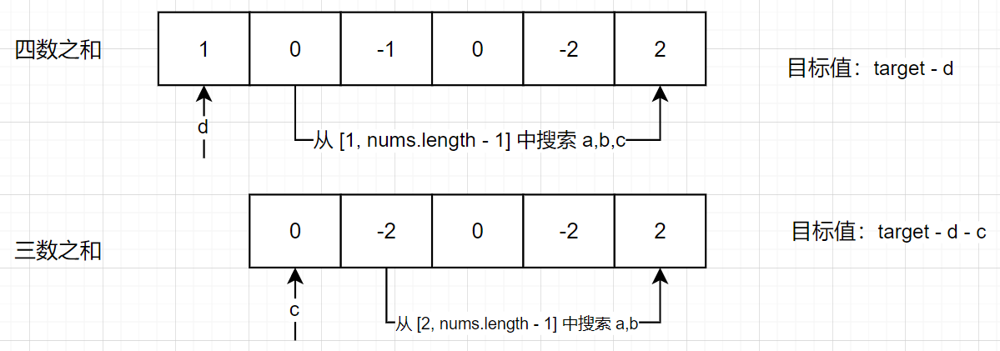
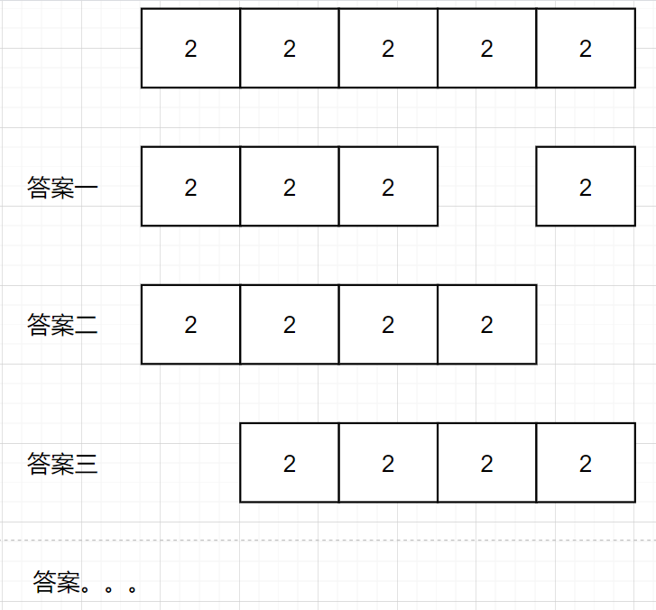

# leetcode_18. 四数之和，n 数之和完结篇

题目链接：[18. 四数之和](https://leetcode-cn.com/problems/4sum/)

_这个人已经靠 `n` 数之和水了好几篇文章了，已经不想再水了_

我之前写过好几篇的 `nSum` 相关的文章，在我的个人主页里面搜索可以发现有三篇相关的文章


当然看的人不多，但是还是决定要把这个类型题写完，也就是今天的终章 `nSum`，在这也引下流，也方便搜索往前的知识

1. [leetcode_15. 三数之和](https://juejin.cn/post/7079754494514298888)
2. [leetcode\_今天面试官高兴，给你面一道 twoSum](https://juejin.cn/post/7079381303493132296)
3. [leetcode_167. 两数之和 II - 输入有序数组](https://juejin.cn/post/7068306074553548830)

上面的文章中最关键的就是[leetcode_15. 三数之和](https://juejin.cn/post/7079754494514298888)这篇文章

# 一、题目描述：

给你一个由 `n` 个整数组成的数组 `nums`，和一个目标值 `target`。请你找出并返回满足下述全部条件且不重复的四元组 `[nums[a], nums[b], nums[c], nums[d]]`（若两个四元组元素一一对应，则认为两个四元组重复）：

- `0 <= a, b, c, d < n`
- `a`、`b`、`c` 和 `d` 互不相同
- `nums[a] + nums[b] + nums[c] + nums[d] == target`

你可以按**任意顺序**返回答案 。

## 示例 1：

```
输入：nums = [1,0,-1,0,-2,2], target = 0
输出：[[-2,-1,1,2],[-2,0,0,2],[-1,0,0,1]]
```

## 示例 2：

```
输入：nums = [2,2,2,2,2], target = 8
输出：[[2,2,2,2]]
```

## 提示：

- `1 <= nums.length <= 200`
- `-10^9 <= nums[i] <= 10^9`
- `-10^9 <= target <= 10^9`

## 题目模板

```js
/**
 * @param {number[]} nums
 * @param {number} target
 * @return {number[][]}
 */
var fourSum = function (nums, target) {};
```

# 二、思路分析：

我在[leetcode_15. 三数之和](https://juejin.cn/post/7079754494514298888)这篇文章说过（没有看过的去看一下），如何把 `n` 降级成我们容易理解的 `2` 数之和，最重要的就是**移位**，变更我们的 `target` 值，这道四数之和要求解的公式为

```
四数之和
a + b + c + d = target
三数之和
a + b + c = 0
```

其实和三数之和没有区别，不就是 `target` 变成了 `0` 而已，并没有什么实质性的变化，所以四数之和的思路同样是去变换 `target` 值然后去寻找合适的数，用下面的图来理解一下



发现了吗？无论是几数之和，都是在两数之和的基础上再加上一层 `for` 循环，两数之和就是我们的 `base case`，我们要做到就是一层层的嵌套循环，反过来就是一个递归，每一次往下递归我们都将把 `n` 的层数减一，最终到我们的 `base case` 两数之和，所以 `nSum` 的答案已经出来了，就是下面的伪代码

```js
const nSum = (nums, n, start, target) => {
  if (n === 2) {
    返回两数之和的结果;
  } else {
    for (let i = start; i < length - 2; i++) {
      得到 n - 1 数之和的结果
      res.push(nSum(nums, n - 1, i + 1, target - nums[i]));
    }
  }
  return res;
};
```

`nSum` 最终的代码就可以用一个简单的递归完成了

## 边界处理

整体的框架没变，但是还要处理一些细节，就拿题目的示例来说 `nums = [2,2,2,2,2], target = 8`，可能的答案有下面这些



它们只是索引不同，但是数值是一致的，按照题目的要求，

**不重复的四元组 `[nums[a], nums[b], nums[c], nums[d]]`（若两个四元组元素一一对应，则认为两个四元组重复）**

我们给出上面的答案是不满足题目的要求的，但也还是有解决方法的，解决方法很简单，就是跳过重复的元素，重复的元素进入到循环后会执行同样的操作，

```
a + b + c + d = target
若 a = 2, 其后紧跟的元素也为 2，则递归相同
b + c + d = target - 2,
c + d = target - 2 - b
```

但是题目所给的 `nums` 是无序的，因此我们需要将数组进行排序，让 `nums` 中重复的元素能够彼此相邻

综上，最终 `AC` 代码如下

# 三、AC 代码：

```js
var fourSum = function (nums, target) {
  const twoSum = (nums, start, target) => {};
  const nSum = (nums, n, start, target) => {
    const result = [];
    if (nums.length < n || n < 2) {
      return result;
    }
    if (n === 2) {
      result.push(...twoSum(nums, start, target));
    } else {
      const length = nums.length;
      // 当数组剩余数量小于 n 时退出
      for (let i = start; i <= length - n; i++) {
        const tempRes = nSum(nums, n - 1, i + 1, target - nums[i]);
        for (const res of tempRes) {
          result.push([nums[i], ...res]);
        }
        while (i <= length - n && nums[i] === nums[i + 1]) i++;
      }
    }
    return result;
  };
  nums.sort((a, b) => a - b);
  return nSum(nums, 4, 0, target);
};
```

`AC` 代码的时间复杂度，有下面几个部分

1. 排序时间复杂度 - `JS sort` 用的是快排，时间复杂度为 `O(nlogn)`
2. 递归时间复杂度 - `n^3`，`n = 4, n = 3` 遍历可能的结果需要时间复杂度为 `O(n)`，而两数之和的时间复杂度为 `O(n)`（这里我采用的是两数之和的双指针解法）

所以总的时间复杂度为 `O(n^3)`

## 总结

四数之和，五数之和，六数之和都可以使用上面的解法，它们的时间复杂度都是再套一个 `for` 循环，即 `O(n)`，为 `O(n^(k-1))`（假设为 `K` 数之和）
