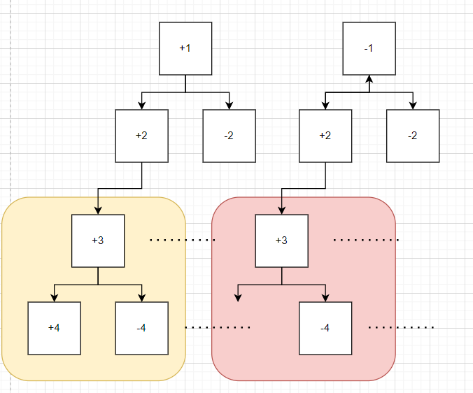

# leetcode_494. 目标和

题目链接: [494. 目标和](https://leetcode.cn/problems/target-sum/)

# 一、题目描述：

给你一个整数数组 `nums` 和一个整数 `target`。

向数组中的每个整数前添加  `'+'` 或 `'-'` ，然后串联起所有整数，可以构造一个 **表达式** ：

例如，`nums = [2, 1]` ，可以在 `2` 之前添加 `'+'` ，在 1 之前添加 `'-'` ，然后串联起来得到表达式 `"+2-1"` 。
返回可以通过上述方法构造的、运算结果等于 `target` 的不同 **表达式** 的数目。

## 示例 1：

```
输入：nums = [1,1,1,1,1], target = 3
输出：5
解释：一共有 5 种方法让最终目标和为 3 。
-1 + 1 + 1 + 1 + 1 = 3
+1 - 1 + 1 + 1 + 1 = 3
+1 + 1 - 1 + 1 + 1 = 3
+1 + 1 + 1 - 1 + 1 = 3
+1 + 1 + 1 + 1 - 1 = 3
```

## 示例 2：

```
输入：nums = [1], target = 1
输出：1
```

## 提示：

- `1 <= nums.length <= 20`
- `0 <= nums[i] <= 1000`
- `0 <= sum(nums[i]) <= 1000`
- `-1000 <= target <= 1000`

## 题目模板

```js
/**
 * @param {number[]} nums
 * @param {number} target
 * @return {number}
 */
var findTargetSumWays = function (nums, target) {};
```

# 二、思路分析：

这道题其实可以使用暴力穷举的方法去做，其实就是求全排列，它的一个思路如下


就是一个树的问题，而且是一个有**重叠子问题**的树，可能上面的用例看得不太直观，将 `[1, 1, 1, 1, 1]` 换成 `[1, 2, 3, 4, 5]`，思路变成下面的情况



简单来说就是，我们求解问题的过程中必然是要遍历一次这棵树的，而且有很多**子树**我们是重复去遍历的

所以优化全排列的思路就有了，利用这个子树去优化算法，所以到这一步，我们就需要去找到一个状态转移方程，利用这个可能重复的子树，其实这个状态转移方程也很好想，如果你之前看过我树相关的文章可能就容易想明白（或者是 `labuladong` 树递归相关的文章），我们要求解的是

> 通过上述方法构造的、运算结果等于 `target` 的不同 **表达式** 的数目。

所以状态就是能够凑成 `target` 的表达式的数目，比如 `-1 + 1 + 1 + 1 + 1 = 3` 和 `+1 - 1 + 1 + 1 + 1 = 3`，然后将这个状态和树联系起来，当去遍历这棵树的时候，不管其它节点，子节点干啥，就只负责当前节点的状态是否转移正确

就比如当前节点为 `-1`，`target` 为 `3`，那么我只需要知道子节点能够凑成 `4` 的数目有多少就行了，其思路如下


然后就是找到 `base case` 也就是边缘值，那么基本这道题用动态规划的方法解答就结束了

_注意_

边缘值应该和你的状态有对应的联系，题目要求的是

> 通过上述方法构造的、运算结果等于 `target` 的不同 **表达式** 的数目。

那么你的 `base case` 应该是**凑成的数目**，解法伪码如下

```js
// 求解以 i 为起点的 nums 数组凑够 sum 的可能结果有多少种
function dp(nums, target, sum, i, memo = new Map()) {
  // base case
  if (i === nums.length) {
    if (sum === target) {
      // 当 sum 等于 target 说明这是 1 种能够凑成功的结果
      return 1;
    } else {
      // 当 sum 等于 target 说明这是 0 种能够凑成功的结果
      return 0;
    }
  }
  // 消除重叠子问题
  if (memo.has(key)) {
    // ...
  } else {
    // 状态转移
    const result =
      dp(nums, target, sum + nums[i], i + 1, memo) +
      dp(nums, target, sum - nums[i], i + 1, memo);
    // ...
  }
}
```

# 三、AC 代码：

```js
/**
 * @param {number[]} nums
 * @param {number} target
 * @return {number}
 */
var findTargetSumWays = function (nums, target) {
  return dp(nums, target, 0, 0, new Map());
};
function dp(nums, target, sum, i, memo = new Map()) {
  if (i === nums.length) {
    if (sum === target) {
      return 1;
    } else {
      return 0;
    }
  }
  const key = i + "," + sum;
  if (memo.has(key)) {
    return memo.get(key);
  } else {
    const result =
      dp(nums, target, sum + nums[i], i + 1, memo) +
      dp(nums, target, sum - nums[i], i + 1, memo);
    memo.set(key, result);
    return result;
  }
}
```

## 总结

这道题可以使用动态规划的方法求解，其中最重要的三点就是，找到 `base case`、重叠子问题、状态转移方程

找到，自然问题就解决了

# 参考文章

1. [动态规划和回溯算法到底谁是谁爹？ - labuladong](https://labuladong.github.io/algo/3/25/82/)
