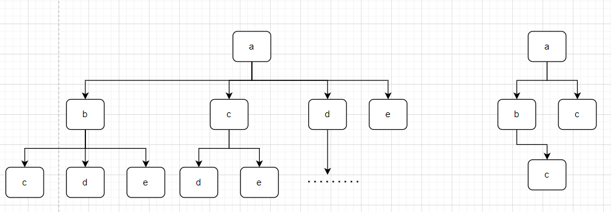

# leetcode_1143. 最长公共子序列

题目链接: [1143. 最长公共子序列](https://leetcode.cn/problems/longest-common-subsequence/)

# 一、题目描述：

给定两个字符串  `text1` 和  `text2`，返回这两个字符串的最长 **公共子序列** 的长度。如果不存在 **公共子序列** ，返回 `0`。

一个字符串的  **子序列**  是指这样一个新的字符串：它是由原字符串在不改变字符的相对顺序的情况下删除某些字符（也可以不删除任何字符）后组成的新字符串。

- 例如，`"ace"` 是 `"abcde"` 的子序列，但 `"aec"` 不是 `"abcde"` 的子序列。

两个字符串的 **公共子序列** 是这两个字符串所共同拥有的子序列。

## 示例 1：

```
输入：text1 = "abcde", text2 = "ace"
输出：3
解释：最长公共子序列是 "ace" ，它的长度为 3 。
```

## 示例 2：

```
输入：text1 = "abc", text2 = "abc"
输出：3
解释：最长公共子序列是 "abc" ，它的长度为 3 。
```

## 示例 3：

```
输入：text1 = "abc", text2 = "def"
输出：0
解释：两个字符串没有公共子序列，返回 0 。
```

## 提示：

- `1 <= text1.length, text2.length <= 1000`
- `text1` 和  `text2` 仅由小写英文字符组成。

## 题目模板

```js
/**
 * @param {string} text1
 * @param {string} text2
 * @return {number}
 */
var longestCommonSubsequence = function (text1, text2) {};
```

# 二、思路分析：

说到最长子序列，可能有人会想到滑动窗口，但是这里是求两个字符串的最长子序列，那么这种情况就不太合适使用滑动窗口了，可以考虑使用暴力求解，暴力求解的思路很‘暴力’，就是求两个字符串的子序列数组，比较两个子序列里面重合的有哪些，再得到最长的一部分就行了


暴力的解法显然复杂度是很高的，很容易享受面试官的下次再来套餐，所以需要使用一点小技巧来解决这个最长公共子序列

从暴力的遍历的角度看，可以从一颗树看出最长的子序列是啥



但是如何让计算机也知道最长的是啥呢？

# 三、AC 代码：

```js
/**
 * @param {string} text1
 * @param {string} text2
 * @return {number}
 */
var longestCommonSubsequence = function (text1, text2) {
  const memo = new Array(text1.length)
    .fill(0)
    .map((i) => new Array(text2.length).fill(-1));
  return dp(text1, text2, 0, 0, memo);
};
function dp(text1, text2, i, j, memo) {
  if (i === text1.length || j === text2.length) {
    return 0;
  }
  if (memo[i][j] !== -1) {
    return memo[i][j];
  }
  if (text1[i] === text2[j]) {
    memo[i][j] = 1 + dp(text1, text2, i + 1, j + 1, memo);
  } else {
    memo[i][j] = Math.max(
      dp(text1, text2, i, j + 1, memo),
      dp(text1, text2, i + 1, j, memo)
    );
  }
  return memo[i][j];
}
```

## 总结

# 参考文章

1. [经典动态规划：最长公共子序列 - labuladong](https://labuladong.gitee.io/algo/3/24/76/)
