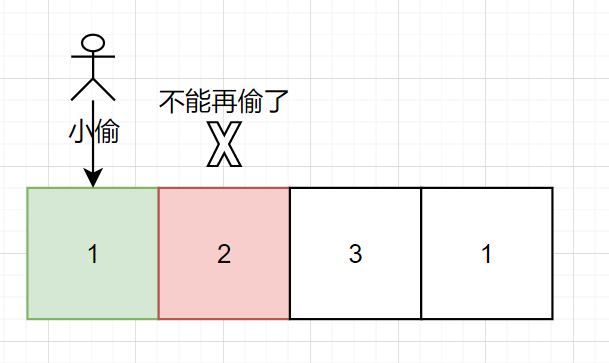
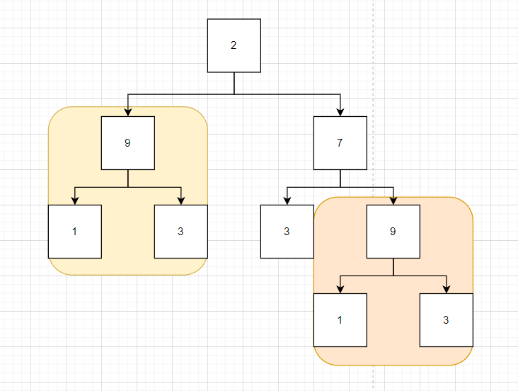
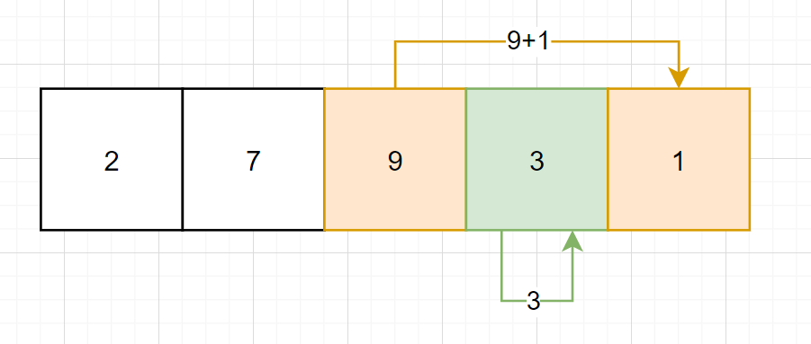

# leetcode_198. 打家劫舍

题目链接: [198. 打家劫舍](https://leetcode.cn/problems/house-robber/)

# 一、题目描述：

你是一个专业的小偷，计划偷窃沿街的房屋。每间房内都藏有一定的现金，影响你偷窃的唯一制约因素就是相邻的房屋装有相互连通的防盗系统，**如果两间相邻的房屋在同一晚上被小偷闯入，系统会自动报警**。

给定一个代表每个房屋存放金额的非负整数数组，计算你 **不触动警报装置的情况下** ，一夜之内能够偷窃到的最高金额。

## 示例 1：

```
输入：[1,2,3,1]
输出：4
解释：偷窃 1 号房屋 (金额 = 1) ，然后偷窃 3 号房屋 (金额 = 3)。
     偷窃到的最高金额 = 1 + 3 = 4 。
```

## 示例 2：

```
输入：[2,7,9,3,1]
输出：12
解释：偷窃 1 号房屋 (金额 = 2), 偷窃 3 号房屋 (金额 = 9)，接着偷窃 5 号房屋 (金额 = 1)。
     偷窃到的最高金额 = 2 + 9 + 1 = 12 。
```

## 提示：

- `1 <= nums.length <= 100`
- `0 <= nums[i] <= 400`

## 题目模板

```js
/**
 * @param {number[]} nums
 * @return {number}
 */
var rob = function (nums) {};
```

# 二、思路分析：

先说思路，看到这个题目的重点，**如果两间相邻的房屋在同一晚上被小偷闯入，系统会自动报警**，也就是说，为了避免报警，小偷只能偷相邻两个房间中的一个，如下图



也就是说，作为小偷，每次你光顾一个房屋，你只能在两个里面选一个，**要么**偷当前光顾的房屋**然后**偷该房屋的下一间房屋的下一间，**要么**偷当前光顾的房屋的下一间，**注意注意**，小细节，这不纯纯状态转移方程吗？状态就是**当前房屋能够获取的最大金额**，动态规划此时不就顺手捏来吗？


如果说你不懂动态规划，也不懂啥是状态转移方程，就想着梭哈代码，也没事，看了这个状态转移方程，你也能发现这就是梭哈的本质

## 状态转移方程

```
// 伪代码
// 小偷光顾 i 号房屋，两种选择
// 1. 偷得 (nums[i]) + 偷 (i + 2) 号房屋及以后所得金额
// 2. 不偷 i 号房屋（所得金额为 0）+ 偷 (i + 1) 号房屋及以后所得金额
dp = max(dp(nums, i + 2) + nums[i], dp(nums, i + 1))
```

这两个东西一比较不就是当前 `i` 号房屋的最优解吗？在把 `i` 换成 `0`，答案显然呼之欲出，把递归的事交给你那该死的电脑

_显然_

这道题目不是只一个状态转移方程能够解决的（超时和栈溢出是这样的）还是得想起来动态规划的两个小兄弟，重叠子问题和边界值（`base case`）

## 重叠子问题

先说这个重叠子问题，这个在纸上写一下就很清晰了，以 `[2,7,9,3,1]` 为例，它的一个遍历过程如下



那两个重叠分支的意思其实就是，到了金额为 `9` 的房屋，小偷可以有两个方案选择，偷了 `9` 再去偷 `1`，或者不偷 `9` 去偷 `3`，即下图



那么根据我们的状态 `dp[2]` (即金额为 `9` 的房屋)，此时值为 `12`，如果不去处理，就会计算两次 `12`，解决方法也很简单，就是做个缓存，每次状态都‘存’起来

```
// 伪代码
if(memo[i] !== 默认值) {
  // 说明已经计算过了
  return memo[i]
}
memo[i] = max(dp(nums, i + 2) + nums[i], dp(nums, i + 1))
```

## 边界值（`base case`）

说完重叠子问题，就得说下边界值（`base case`），它是终结你递归的角色，递归的尽头，这道题 `base case` 非常简单，因为我们的状态是跟随 `nums` 的长度不断移进变换的，因此当超过 `nums.length` 的时候就可以认为‘没得偷了’，即返回金额 `0`

```
if(i > nums.length) {
  return 0
}
```

所以 `AC` 代码如下

# 三、AC 代码：

```js
/**
 * @param {number[]} nums
 * @return {number}
 */
var rob = function (nums) {
  const memo = new Array(nums.length).fill(-1);
  return dp(nums, 0, memo);
};
function dp(nums, i, memo) {
  if (i >= nums.length) {
    return 0;
  }
  if (memo[i] !== -1) {
    return memo[i];
  }
  memo[i] = Math.max(dp(nums, i + 1, memo), nums[i] + dp(nums, i + 2, memo));
  return memo[i];
}
```

## 总结

这道题可以使用动态规划的方法求解，其中最重要的三点就是，找到 `base case`、重叠子问题、状态转移方程

找到，自然问题就解决了
