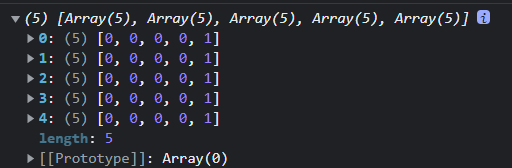

# JS 离谱到给离谱它妈开门之二维数组创建

今天做一道 leetcode 题，想着需要创建一个二维数组，赋值初始化为 0，用 C、C++ 和 Java 的家人们可能疑惑了，这有什么？不就一行代码的事？


```java
int[][] arr = new int[n][n];
```

用 js 创建的我想着搞个花活？我得用一些奇奇怪怪的 API，不然用两个 for 循环不显得我太菜了？于是下面这篇代码出现了

```js
let memory = new Array(n + 1).fill(0);
let temp = memory.concat();
memory.fill(temp);
```

concat() 返回的是新数组没问题吧，我填充的可是拷贝的数组，不是自己套自己喔


后面我就没在管这个二维数组了，去刷 leetcode 了，我刷的那条题也是牛逼，我写完代码逻辑后，我觉得没问题呀，我就把示例填了进去，结果过了，我信心倍增


然后我去提交，结果发现第三个就测试用例就错了？？？


woc，不可能！我那么精妙绝伦的解法怎么可能会出错？？于是我反反复复的看我的解法好几遍，全然没有去看我创建的`二维数组`，最后无奈我把代码从网页上拉下来，准备本地调试，一开始调试的时候我都还没有注意到`二维数组`的问题，后面想看看`二维数组`的复制情况，好家伙，可算被我发现了，代码如下

```js
// 查看复制情况
memory[start][end] = res;
```

好家伙，竟然是，一整列都赋值了？？




后来我再仔细一想，js 数组它存的是地址喔，你 fill 不就是把地址给存进去了吗？我上面的代码的赋值其实都是给 fill() 参数中对应的那个数组的赋值

# 总结

其实这个问题主要还是我太菜了，没有注意到这个问题，不能怪 JS，C++，java 人家也是存的地址，同样的代码，也是同样的结果，只能说是自己没有严格的规范编写代码，忽略了本质

PS：其实上面那个已经是 v2 版本了，有个 v1 版本更是让我震惊

```js
let memory = new Array(n).fill(0);
memory.fill(memory);
```
