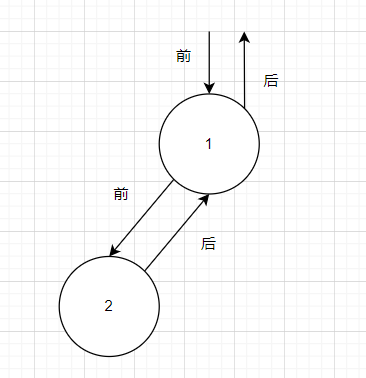
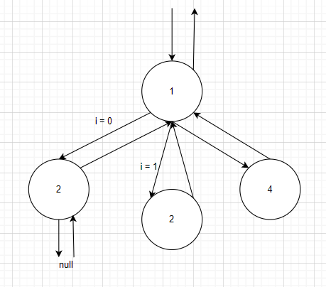
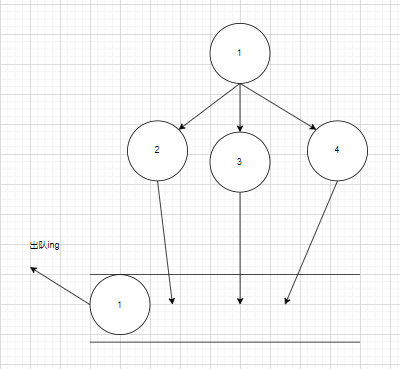

leetcode 之浅谈 N 叉树

# 背景介绍

之前去看 vue-router 源码的时候发现了 N 叉树的`经典`遍历框架，在源码中找到数据结构之类的算法，其实不算是很简单（对我来说）因为源码本身是嵌套嵌套再嵌套，无限套娃，有很多技术细节容易陷进去，有些很经典的数据结构可能一下子没看到就认不出来，而之所以能在很多代码中发现提炼出来它是一个 N 叉树遍历是因为在这之前就已经刷过一些 N 叉树的题目，也去了解过 labuladong 提到过的 N 叉树遍历框架，那么这篇文章就带家人去看一下 leetcode 上关于 N 叉树的题目

看完这篇文章你可以去尝试一下以下题目（放心都是简单题）

1. [559. N 叉树的最大深度](https://leetcode-cn.com/problems/maximum-depth-of-n-ary-tree/)
2. [589. N 叉树的前序遍历](https://leetcode-cn.com/problems/n-ary-tree-preorder-traversal/)
3. [590. N 叉树的后序遍历](https://leetcode-cn.com/problems/n-ary-tree-postorder-traversal/)
4. [429. N 叉树的层序遍历](https://leetcode-cn.com/problems/n-ary-tree-level-order-traversal/)

# N 叉树遍历框架

下面这个就是所谓的`N 叉树`遍历框架

```ts
const traverse = (root) => {
  if (root === null) {
    return;
  }
  for (let i = 0; i < root.children.length; i++) {
    traverse(root.children[i]);
  }
};
```

现在看着很简单，但其实可以做很多事情，像二叉树的前序后序位置的定义可以嵌套在这个框架里面，加上前序后序位置的代码就是下面这样

```ts
const traverse = (root) => {
  if (root === null) {
    return;
  }
  // 前序位置
  for (let i = 0; i < root.children.length; i++) {
    traverse(root.children[i]);
  }
  // 后序位置
};
```

先来一张前序后序位置的经典图片



前序位置应该很好理解，而后序位置就是一个`返回`的过程，也就是所有的 children 都遍历完了，返回退出 for 循环的一个位置



可能有家人想问了，那中序位置呢？其实 N 叉树的中序位置没有具体的定义，二叉树的中序定义就是`左根右`这样的顺序，但放到 N 叉树身上似乎不太成立，N 叉树子节点为空的时候是只有一个指针的，不像二叉树两个子节点为空时还存在一个`转向`的功能，左子树转换到右子树（我当然不会说是我不会了，手动狗头）


那么回到前序和后序位置, N 叉树拿到这两个位置有什么用呢？其实还是和二叉树一样，前序位置你能拿到父节点给子节点的`信息`，后序位置父节点能拿到子节点返回的`信息`，其实这两个位置也暗含`回溯`和`动态规划`的思想，就是自顶向下和自顶向上的思路，`动态规划`也有分解问题的思路在里面，当看下面的 leetcode 题目的解析时，可以套着上面的思路去理解一下

# 589. N 叉树的前序遍历

一个简单题，开胃小菜，其实你光看上面的前序位置的思路已经做出来大半了，就是遍历一遍 N 叉树不就行了吗？非常简单，但是有一个小问题，需要记录我们运动的轨迹，这个问题也很好解决，放一个数组在遍历函数外面就能解决这个问题，代码如下

```js
var preorder = function (root) {
  let res = [];
  const traverse = (root) => {
    if (root === null) {
      return;
    }
    res.push(root.val);
    for (let i = 0; i < root.children.length; i++) {
      traverse(root.children[i]);
    }
  };
  traverse(root);
  return res;
};
```

`res = []` 就是我们存放运行轨迹的地方，前序位置进到这个节点时，就存放一次 value(节点值), 可能有严谨的家人们发问了，你这个多少有点污染命名空间喔，还要再耗费一个脑细胞去想一下遍历函数的名字，其实我们还可以使用`动态规划`的思想去解决一下这个问题，这个就跟后序位置有关了，依赖于子树的返回`信息`

```js
var preorder = function (root) {
  if (root === null) {
    return [];
  }
  const currentVal = [];
  for (let i = 0; i < root.children.length; i++) {
    currentVal.push(...preorder(root.children[i]));
  }
  return [root.val, ...currentVal];
};
```

当然这种解法没必要，很浪费空间，每次都要遍历都创建一个数组，很容易内存就爆了

# 590. N 叉树的后序遍历

我觉得后序遍历根本不用讲了好吧，把 `res.push(root.val);` 换个位置就行了

```js
// ...
for (let i = 0; i < root.children.length; i++) {
  traverse(root.children[i]);
}
res.push(root.val);
// ...
```

动态规划同样也可以用于这个后序遍历，分解问题，子树的子树返回不就行了吗？

```js
var postorder = function (root) {
  const traverse = (root) => {
    if (root === null) {
      return;
    }
    const currentVal = [];
    for (let i = 0; i < root.children.length; i++) {
      currentVal.push(...traverse(root.children[i]));
    }
    return [...currentVal, root.val];
  };
  return traverse(root);
};
```

有些事其实就是那么神奇，递归就是这么有意思的一个东西，最简单的代码做最多的事，理解这个前序和后序的概念，很多二叉树的题就很简单了

# 559. N 叉树的最大深度

N 叉树的最大深度同样还是可以使用到我们的前序后序位置，先上一段经典的解法

```js
var maxDepth = function (root) {
  if (root == null) {
    return 0;
  }
  let res = -1;
  const traverse = (root, depth) => {
    if (root === null) {
      return;
    }
    res = Math.max(res, depth);
    for (let i = 0; i < root.children.length; i++) {
      traverse(root.children[i], depth + 1);
    }
  };
  traverse(root, 1);
  return res;
};
```

仔细看，是不是异曲同工，是不是熟悉的前序位置，是不是熟悉的外部变量，小小传递一个参数就可以轻松记录出最大深度，当然还有更`优雅`的解法，动态规划式的解法，而且因为是深度信息的传递，不用太过担心内存的问题

```js
var maxDepth = function (root) {
  if (root == null) {
    return 0;
  }
  let res = 0;
  for (let i = 0; i < root.children.length; i++) {
    res = Math.max(res, maxDepth(root.children[i]));
  }
  return 1 + res;
};
```

注意一个小细节，因为 for 循环的存在, res 其实是跟着 for 循环的遍历变化的，通过比较多个子树的最大深度得到当前树的最大深度

# N 叉树的层序遍历

其实这部分和 vue-router 没有太大的关系，因为 vue-router 使用的是递归式的遍历，但是递归转迭代其实已经是老生常谈的话题，了解以下 N 叉树的层序遍历还是有必要的

层序遍历其实使用了`队列`这种数据结构的特性，先进先出，遍历完某个节点后再去把它的子节点梭哈到队列当中，那么下一次出队的时候就能够保证这个遍历的顺序，如果了解过二叉树的层序遍历应该很好理解( N 叉树的层序遍历甚至比二叉树的简单)，来一张简单图片理解一下这个层序遍历



解题代码如下

```js
var levelOrder = function (root) {
  const nodes = [root];
  const res = [];
  while (nodes.length !== 0) {
    node = nodes.shift();
    res.push(node.val);
    for (let i = 0; i < node.children.length; i++) {
      nodes.push(node.children[i]);
    }
  }
  return res;
};
```

不过上面这种解法是过不了 leetcode 的，因为 leetocde 需要的数据结构其实是这样

```js
[
  [1], // 第一层
  [3, 2, 4], // 第二层
  [5, 6],
]; // 第三层
```

其实这个需求也很好解决，因为下一层的大小(length)是由上一层决定的，而每一次遍历都只会有一层的节点，因为上一层的节点都出队了，所以只要拿到`当前`层的节点数大小，就可以得到`当前`层的 val 数组，修改代码如下

```js
// ...
const currentVal = [];
const currentLength = nodes.length;
for (let i = 0; i < currentLength; i++) {
  node = nodes.shift();
  currentVal.push(node.val);
  if (node.children !== null) {
    for (let j = 0; j < node.children.length; j++) {
      nodes.push(node.children[j]);
    }
  }
}
res.push(currentVal);
// ...
```

# 总结

N 叉树其实在实际应用中还是能够碰见的，像多级导航列表，路由列表这种，都是一些常用的，反而是二叉树这样标准的结构不是很常见，但是二叉树的许多性质和算法都是可以应用到 N 叉树上面的，而且二叉树更容易理解，但多说无益实践最重要，去 leetcode 拿下类似题目吧
