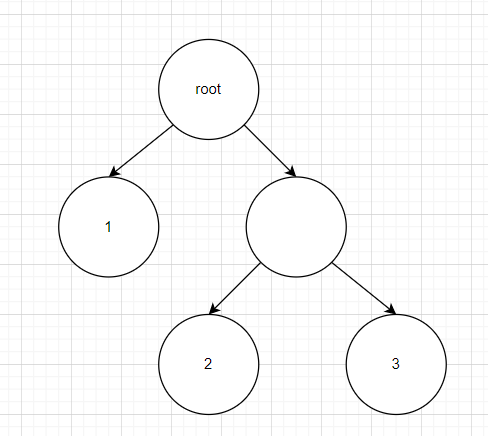
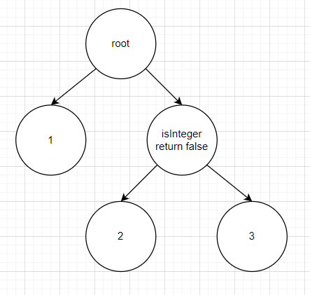
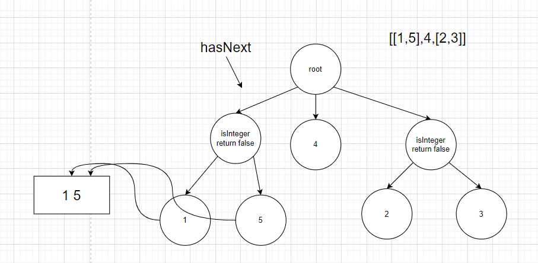
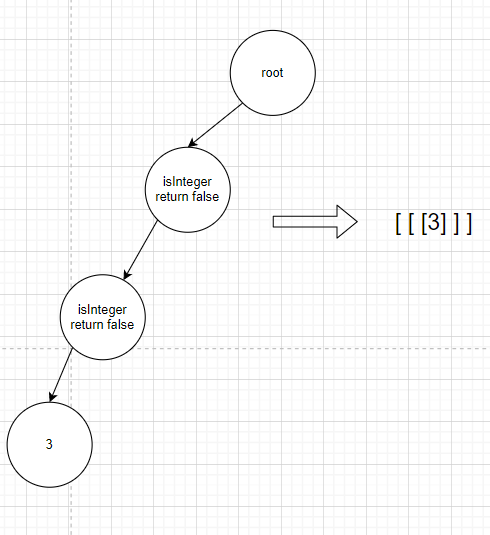

# leetcode_341. 扁平化嵌套列表迭代器

题目链接: [341. 扁平化嵌套列表迭代器](https://juejin.cn/post/7066359416852840479)

前排提示，这是一道跟树有关的题目，而且是 N 叉树，关于 N 叉树的入门题目可以参考我之前的一篇文章，[leetcode 之浅谈 N 叉树](https://juejin.cn/post/7065337408128024583)

# 题目

给你一个嵌套的整数列表 nestedList 。每个元素要么是一个整数，要么是一个列表；该列表的元素也可能是整数或者是其他列表。请你实现一个迭代器将其扁平化，使之能够遍历这个列表中的所有整数。

实现扁平迭代器类 `NestedIterator` ：

- `NestedIterator(List<NestedInteger> nestedList)` 用嵌套列表 `nestedList` 初始化迭代器。
- `int next()` 返回嵌套列表的下一个整数。
- `boolean hasNext()` 如果仍然存在待迭代的整数，返回 `true` ；否则，返回 `false` 。

你的代码将会用下述伪代码检测：

```
initialize iterator with nestedList
res = []
while iterator.hasNext()
  append iterator.next() to the end of res
return res
```

如果 res 与预期的扁平化列表匹配，那么你的代码将会被判为正确。

## 示例 1：

```
输入：nestedList = [[1,1],2,[1,1]]
输出：[1,1,2,1,1]
解释：通过重复调用  next 直到  hasNext 返回 false，next  返回的元素的顺序应该是: [1,1,2,1,1]。
```

## 示例 2：

```
输入：nestedList = [1,[4,[6]]]
输出：[1,4,6]
解释：通过重复调用  next  直到  hasNext 返回 false，next  返回的元素的顺序应该是: [1,4,6]。
```

## 提示：

- `1 <= nestedList.length <= 500`
- 嵌套列表中的整数值在范围 `[-106, 106]` 内

## 代码模板

```js
var NestedIterator = function (nestedList) {};

NestedIterator.prototype.hasNext = function () {};

NestedIterator.prototype.next = function () {};
```

# 解法

首先分析一下这个题目，可以得出几个核心关键词，扁平化，嵌套，列表，迭代器，然后结合示例以及代码模板其实可以得到下面的提示

- 扁平化，需要将类似 `[[1,2],3]` 变成这样 `[1,2,3]`
- 嵌套，说明有可能是多级嵌套的数据结构，比如 `[[1,[2,3]]]`
- 列表，即数组
- 迭代器，每一次迭代，先判断有没有，然后返回一个，即需要解答的 `hasNext` 和 `next` 部分

首先看到这个数据结构，你能想到什么？就拿这个 `[[1,[2,3]]]` 来说，是不是有点像树呢？我们将它画出来就是这个样子



然后对于这种数据结构是不是有点眼熟呢？可能？就是有没有一种可能，题目说的这个`扁平化嵌套列表`其实是一个 N 叉树呢？

然后回到代码模板中对, NestedInteger 这个接口的定义

```js
function NestedInteger() {
  this.isInteger = function () {
    // ...
  };

  this.getInteger = function () {
    // ...
  };

  this.getList = function () {
    // ...
  };
}
```

`[[1,[2,3]]]` 可以完美转身，变为下图的数据结构



那么问题来了，怎么解决这个问题呢？第一扁平化嵌套列表的处理，扁平化不就是把嵌套列表，全都放到一个`数组`里面嘛，嵌套列表就是遍历树，遍历树的时候放到`一个数组`就行了，这个其实就是`回溯`递归遍历 N 叉树，好家伙直接降维打击，一个 N 叉树遍历解决，遍历 N 叉树的解法我前一篇文章讲过，就是[leetcode 之浅谈 N 叉树](https://juejin.cn/post/7065337408128024583), 然后你们也可以去看一下 N 叉树的遍历的 leetcode 题目, [589. N 叉树的前序遍历](https://leetcode-cn.com/problems/n-ary-tree-preorder-traversal/)（是简单题，而这题是中等题），然后看看是不是有共通之处

第二其实就是迭代器的处理，迭代器需要实现的两个功能

1. 一是判断有没有
2. 二是返回下一个值就是 next

其实这个也很好解决，当你把 N 叉树遍历完了以后，返回一个结果数组 `arr = [1,2,3,4]`, `hasNext` 不就是 `return arr.length > 0` 吗？那 `next` 也简单，就是 `return arr.shift()`

所以解法如下

## 解法一

```js
var NestedIterator = function (nestedList) {
  const res = [];
  const traverse = (root) => {
    for (const child of root) {
      if (child.isInteger()) {
        res.push(child.getInteger());
      } else {
        traverse(child.getList());
      }
    }
  };
  traverse(nestedList);
  this.res = res;
};

NestedIterator.prototype.hasNext = function () {
  return this.res.length > 0;
};

NestedIterator.prototype.next = function () {
  return this.res.shift();
};
```

这其实也是一个深度优先搜索, dfs

但上面这个解法，虽然好理解，但是需要一次性将`整个数组`扁平化，其实还可以再优化一下

## 解法二

优化的思路就是，需要迭代的时候再去遍历，就是 `next()` or `hasNext()` 的时候遍历，这个也很好理解，因为 N 叉树是有 N 个子树的，那迭代一次，就遍历一个子树不就行了？如下图



具体代码如下

```js
var NestedIterator = function (nestedList) {
  this.res = nestedList;
};

NestedIterator.prototype.hasNext = function () {
  while (this.res.length > 0 && !this.res[0].isInteger()) {
    let nums = [];
    const list = this.res.shift().getList();
    for (let i = 0; i < list.length; i++) {
      nums.push(list[i]);
    }
    this.res.unshift(...nums);
  }

  return this.res.length > 0;
};

NestedIterator.prototype.next = function () {
  return this.res.shift().getInteger();
};
```

注意其实上面的代码还有一个小细节，就是我们明明只需要遍历一棵子树，为什么不是 if 而是 while?

```js
while (this.res.length > 0 && !this.res[0].isInteger()) {
  // ...
}
```

因为我们需要保证节点第一个不是列表，那么对于 `[[3]]`, 列表嵌套列表的情况就需要再进一次循环，所以应该使用 **while**



