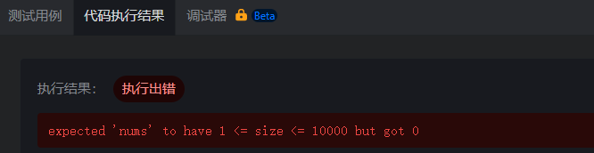
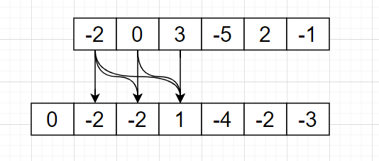
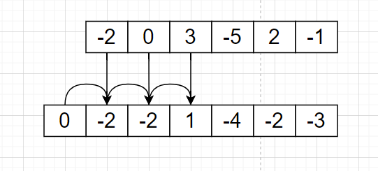

# leetcode_303. 区域和检索 - 数组不可变

题目链接: [303. 区域和检索 - 数组不可变](https://leetcode-cn.com/problems/range-sum-query-immutable/)

# 题目

给定一个整数数组 `nums`，处理以下类型的多个查询:

1. 计算索引  `left`  和  `right` （包含 `left` 和 `right`）之间的 `nums` 元素的 和 ，其中  `left <= right`

实现 `NumArray` 类：

- `NumArray(int[] nums)` 使用数组 `nums` 初始化对象
- `int sumRange(int i, int j)` 返回数组 `nums`  中索引  `left`  和  `right`  之间的元素的**总和**，包含  `left`  和  `right`  两点（也就是  `nums[left] + nums[left + 1] + ... + nums[right]`)

## 示例 1：

```
输入：
["NumArray", "sumRange", "sumRange", "sumRange"]
[[[-2, 0, 3, -5, 2, -1]], [0, 2], [2, 5], [0, 5]]
输出：
[null, 1, -1, -3]

解释：
NumArray numArray = new NumArray([-2, 0, 3, -5, 2, -1]);
numArray.sumRange(0, 2); // return 1 ((-2) + 0 + 3)
numArray.sumRange(2, 5); // return -1 (3 + (-5) + 2 + (-1))
numArray.sumRange(0, 5); // return -3 ((-2) + 0 + 3 + (-5) + 2 + (-1))
```

## 提示：

- `1 <= nums.length <= 104`，注意这里不是我写错了，而是目前这题 `nums.length` 需要大于等于 `1`（但是题目没改，如果我理解错了请评论告诉我修正），既不需要考虑空数组的问题
- `-105 <= nums[i] <= 105`
- `0 <= i <= j < nums.length`
- 最多调用 `10^4` 次 `sumRange` 方法



## 代码模板

```js
/**
 * @param {number[]} nums
 */
var NumArray = function (nums) {};

/** 
 * @param {number} left 
 * @param {number} right
 * @return {number}
 */
NumArray.prototype.sumRange = function (left, right) {};
```

# 解法

首先分析一下题目，**区域检索**，就是数组一个区域检索出来，然后求**总和**，那这题其实就有思路了呀，检索我熟，我可是 `for` 循环集大成者，所有检索我都先暴力一波 `for` 循环，甭管它什么简单题中等题困难题，区域也好解决，都说了是集大成者，我做一个限制就行了嘛，非常简单啊，所以我这个 `sumRange` 可以这样写

```js
var NumArray = function (nums) {
  this.nums = nums;
};
NumArray.prototype.sumRange = function (left, right) {
  let res = 0;
  for(let i = left; i <= right; i++) {
    res += this.nums[i];
  }
  return res;
};
```

不愧是简单题，我一个 `for` 循环就弄出来了


但是啊，要注意，有个小细节差点被漏掉，它那短短四行的提示，最后一个竟然故意的去说了最多调用 `104` 次 `sumRange` 方法，不是 `leetcode` 你调这么多次干嘛？

但回到 `sumRange` 本身，我们用 `for` 循环实现的时间复杂度是 `O(n)`，这意味着我们在 `leetcode` 的极限测压下，可能时间复杂度会达到 `O(10^4*n)`，这个时候我们就要考虑优化一下 `sumRange`

因此我们的解法必须要兼顾下面两个核心点

- 区域检索求和
- `sumRange` 时间复杂度要尽可能的小

## 题解

没错，文章来到了今天的主角，**前缀和**，前缀和是个啥玩意呢？我们先对它这个**示例一**，演示一波前缀和，看下图



看明白没有？前缀和就是原数组前 n 个和的结果，它的公式就是下面这个

```
i >= 1, preSum[0] = 0
preSum[i] = nums[0] +...+ nums[i-1]

比如：
preSum[3] = nums[0] + nums[1] + nums[2] = -2 + 0 + 3 = 1
```

为什么 `i >= 1` 和 `preSum[0] = 0`？这实际上是为了方便计算前 n 个和，以及存储，当然这都是细节问题，不同的人写的会不一样，但是最重要的是**前缀和**的理解，上面的过程其实也相当于下面这个



也就是下面的新公式，为题解的构建 `preSum` 的核心代码

```
i >= 1, preSum[0] = 0
preSum[i] = preSum[i-1] + nums[i-1]

比如：
preSum[3] = preSum[2] + nums[2] = -2 + 3 = 1
```

**前缀和**就是存放前 n 个和的结果，`for` 循环遍历中的中间结果的存放，从 `0 -> 0`，`0 -> 1`，。。。`0 -> n`，将这个结果存放起来帮助我们快速的得到 `sumRange` 的值，而不是每次都去 `for` 循环一次

可能这个时候你们有些疑问了，如果是 `left = 1`，`right = 3`，那 `1 -> 2`，`2 -> 3` 的这种中间结果怎么不去计算呢？原因是**没必要**，我们再次回到**前缀和**的公式，并带入 `left` 和 `right`

```
preSum[right + 1] = nums[0] + ... + nums[right]
preSum[left] = nums[0] + ... + nums[left - 1]

preSum[right + 1] - preSum[left] = nums[left] + ... + nums[right]
```

所以**前缀和**只需要 `0 -> n` 的中间结果，就可以得到所有的**区域检索总和**值

而解题代码就是下面这样

```js
var NumArray = function(nums) {
  const preSum = new Array(nums.length + 1).fill(0);
  for(let i = 1; i < preSum.length; i++) {
    preSum[i] = preSum[i-1] + nums[i-1];
  }
  this.preSum = preSum;
};

NumArray.prototype.sumRange = function(left, right) {
  return this.preSum[right+1] - this.preSum[left];
};
```

# 总结

**前缀和**是利用了一次遍历数组的中间结果，作为后序计算特定的需求的基础值，并借此快速解决需求，这种思路像在 `01`背包，和动态规划都有用到，虽然`303`是简单题，但是内部的理念还是可以去深入了解的