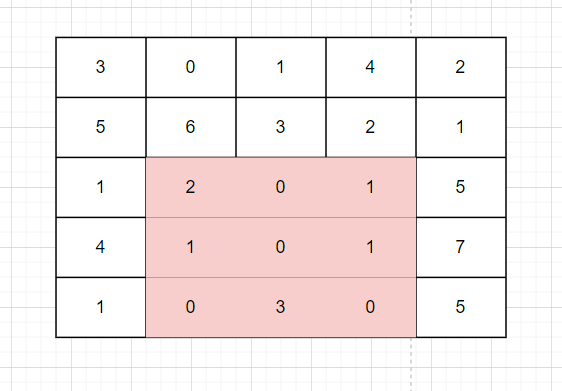
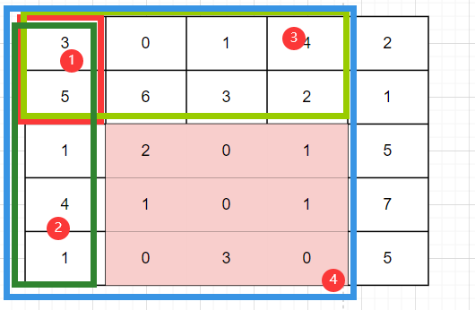
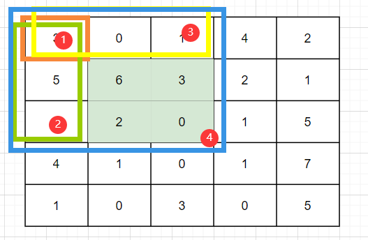
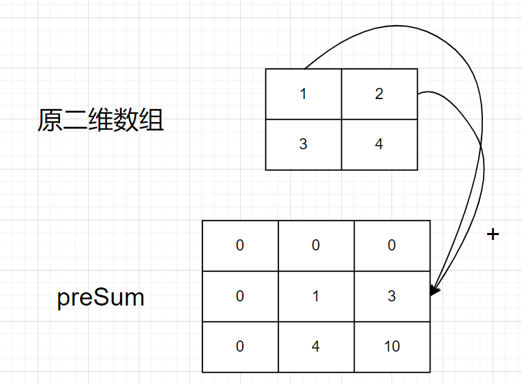
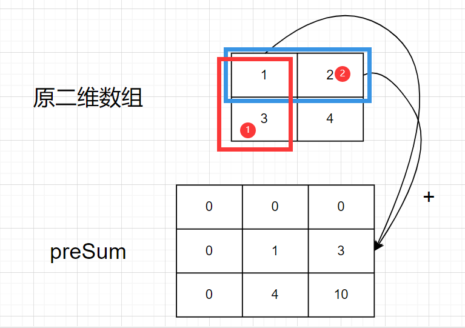
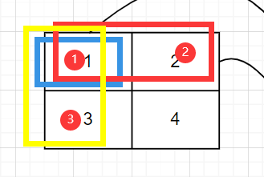

# leetcode_304. 二维区域和检索 - 矩阵不可变

题目链接: [304. 二维区域和检索 - 矩阵不可变](https://leetcode-cn.com/problems/range-sum-query-2d-immutable/)

# 题目

给定一个二维矩阵 matrix，以下类型的多个请求：

- 计算其子矩形范围内元素的总和，该子矩阵的 左上角 为 (row1, col1) ，右下角 为 (row2, col2) 。

实现 NumMatrix 类：

- `NumMatrix(int[][] matrix)` 给定整数矩阵 `matrix` 进行初始化
- `int sumRegion(int row1, int col1, int row2, int col2)`  返回**左上角**`(row1, col1)`、**右下角**`(row2, col2)`所描述的子矩阵的元素**总和**。

## 示例 1:


```
输入:
["NumMatrix","sumRegion","sumRegion","sumRegion"]
[[[[3,0,1,4,2],[5,6,3,2,1],[1,2,0,1,5],[4,1,0,1,7],[1,0,3,0,5]]],[2,1,4,3],[1,1,2,2],[1,2,2,4]]
输出:
[null, 8, 11, 12]

解释:
NumMatrix numMatrix = new NumMatrix([[3,0,1,4,2],[5,6,3,2,1],[1,2,0,1,5],[4,1,0,1,7],[1,0,3,0,5]]);
numMatrix.sumRegion(2, 1, 4, 3); // return 8 (红色矩形框的元素总和)
numMatrix.sumRegion(1, 1, 2, 2); // return 11 (绿色矩形框的元素总和)
numMatrix.sumRegion(1, 2, 2, 4); // return 12 (蓝色矩形框的元素总和)
```

## 提示

- `m == matrix.length`
- `n == matrix[i].length`
- `1 <= m, n <= 200`
- `-105 <= matrix[i][j] <= 105`
- `0 <= row1 <= row2 < m`
- `0 <= col1 <= col2 < n`
- `最多调用 10^4 次 sumRegion 方法`

## 代码模板

```js
/**
 * @param {number[][]} matrix
 */
var NumMatrix = function (matrix) {};

/**
 * @param {number} row1
 * @param {number} col1
 * @param {number} row2
 * @param {number} col2
 * @return {number}
 */
NumMatrix.prototype.sumRegion = function (row1, col1, row2, col2) {};
```

# 解法

首先结合题目名称和题目要求分析一下题目，**二维区域和检索**，求出一个子矩阵的总和，很快啊，这题我灵光一闪，都给了矩阵的坐标，左上角和右下角，那不就是一个遍历二维数组的事吗？这个矩阵不就是就二维数组？`while`/`for`循环轮番上，看我不拿捏这道题，以示例 1 为例，求红色矩形框



这个 `sumRegion` 完全可以像下面这样写

```js
// matrix[2][1] +...+ matrix[2][3]
// matrix[2][1] +...+ matrix[4][1]
// === 8
const sumRegion = (row1, col1, row2, col2) => {
  let res = 0;
  for (let i = row1; i <= row2; i++) {
    for (let j = col1; j <= col2; j++) {
      res += matrix[i][j];
    }
  }
  return res;
};
```

但是像这样的写法这会收到**超时**警告一枚，其实原因就是 `sumRegion` 调用的太多，回到题目给我们的提示

- `最多调用 10^4 次 sumRegion 方法`

本身设计的 `sumRegion` 的时间复杂度就有 `O(n^2)`，是一个双重循环，如果还要去极限调用 `10000` 次的话，那必超时，所以优化 `sumRegion` 势在必行

那么应该如何优化 `sumRegion`？

## 优化 sumRegion

回到我们的示例 `1`，红色子矩阵其实就是可以由另外四个矩阵计算得来，如下图所示



由上可知

**红色子矩阵 = (4 - 3 - 2) + 1**

_1 矩阵是因为 3 和 2 共同有一块重叠，4 - 3 - 2 相当于减了两次_

而且有一个细节，就是，这四个矩阵都是以`(0,0)`作为左上角的

其实如果换成另一个矩阵，就是示例 1 中的绿色矩阵我们同样也能靠这个规律得出来，如下图所示



所以只要我们把所有以`(0,0)`作为左上角的矩阵的和计算出来并存储，那么任意一次调用 `sumRegion` 都可以通过上面的公式一次演算

这就是**前缀和**的思路，把有用的中间结果先计算出来，然后下一次 `sumRegion` 这类函数就能够依赖于中间结果快速返回答案

可是又有一个问题，怎么构建这个 `preSum` 呢？

## 构建 preSum

一维到二维是一种思维上的突破，一维的思想在二维能够复用，但一维的思想在二维不能完全**通用**，不能解决完所有问题，像一维的**前缀和**，经典的一个数组问题，一维 `preSum` 的定义如下

```
i >= 1, preSum[0] = 0
preSum[i] = nums[0] +...+ nums[i-1]

比如：
preSum[3] = nums[0] + nums[1] + nums[2] = -2 + 0 + 3 = 1

preSum[3] 对应着 num[0]...num[2] 的总和
```

那么二维呢？二维的 `preSum` 的索引对应着原二维数组的什么呢？以 `matrix = [[1,2],[3,4]]` 请看下图



_preSum 为何多出 1 行 1 列？后面会介绍_

就是下面的关系

```
preSum[1][1] = matrix[0][0]
preSum[1][2] = matrix[0][0] + matrix[0][1]
preSum[2][1] = matrix[0][0] + matrix[0][1]
preSum[2][2] = matrix[0][0] + matrix[0][1] + matrix[1][0] + matrix[1][1]

综上可得
matrix.length = rowLength, matrix[0].length = colLength
1 <= i <= n, j >= 1
preSum[0][0]...preSum[0][colLength] = 0
preSum[0][0]...preSum[rowLength][0] = 0

preSum[i][j] = matrix[0][0] +...+ matrix[0][j-1] +...+ matrix[i-1][0] +...+ matrix[i-1][j-1]
```

在二维数组里，**前缀和**的定义就是，`[0,0] -> [i,j]` 矩阵中元素的总和

而为什么说一维数组的思想能够在二维数组上复用？请看下图



1, 2 矩阵不就是对应着一维**前缀和**吗？还不了解一维**前缀和**的可以参考我这篇文章，[leetcode_303. 区域和检索 - 数组不可变](https://juejin.cn/post/7066809892728176671)，那么我们唯一需要烦恼的就是 `presSum[2][2]` 也就是那个最大的矩阵需要怎么加入到**复用**一维**前缀和**的中间结果？其实上面已经说过了

```
红色子矩阵 = (4 - 3 - 2) + 1

反过来就是
4 = 红色子矩阵 + 3 + 2 - 1
```

结合下图更为清晰



综上我们可以得出一条关于**前缀和**的新公式

```
matrix.length = rowLength, matrix[0].length = colLength
1 <= i <= n, j >= 1
preSum[0][0]...preSum[0][colLength] = 0
preSum[0][0]...preSum[rowLength][0] = 0

preSum[i][j] = matrix[i-1][j-1] + preSum[i][j-1] + preSum[i-1][j] - preSum[i-1][j-1]
```

之所以 `preSum` 会多出来 1 行 1 列，就是为了矩阵为 `matrix[0][0] -> matrix[0][0]` 这种**单格**矩阵也能计算出其前缀和，这种公式的优化也帮助我们减少构建 `preSum` 的开销，避免使构建 `preSum` 时重蹈覆辙 `sumRegion` 的 `O(n^2)` 时间复杂度，如果你没有利用你**前缀和**的这些**中间结果**，那么在构建 `preSum` 时就只能用 `O(n^2)` 的 `sumRegion` 那种方法去计算，这会导致构建**前缀和**时间开销是 `O(n^2)`

基于上文，所以这道题的解法如下

## 题解

```js
var NumMatrix = function (matrix) {
  const rowLength = matrix.length;
  if (rowLength > 0) {
    colLength = matrix[0].length;
    const preSum = new Array(rowLength + 1)
      .fill(0)
      .map(() => new Array(colLength + 1).fill(0));
    for (let i = 1; i <= rowLength; i++) {
      for (let j = 1; j <= colLength; j++) {
        preSum[i][j] =
          preSum[i - 1][j] +
          preSum[i][j - 1] +
          matrix[i - 1][j - 1] -
          preSum[i - 1][j - 1];
      }
    }
    this.preSum = preSum;
  }
};

NumMatrix.prototype.sumRegion = function (row1, col1, row2, col2) {
  return (
    this.preSum[row2 + 1][col2 + 1] -
    this.preSum[row1][col2 + 1] -
    this.preSum[row2 + 1][col1] +
    this.preSum[row1][col1]
  );
};
```

`sumRegion` 的开销是 `O(1)`，构建 `NumMatrix` 里面的**前缀和**时间开销是 `O(n^2)`

# 总结

这种利用中间结果的思想，在二叉树**动态规划**式的递归和一些经典的动态规划，比如斐波那契数列都有充分的体现，像二叉树的**动态规划**式的递归放在这里就很好理解，我只需要定义好**初值**，返回相应的三个矩阵的值，然后知道我**当前**的遍历需要做的事，就是通过返回值计算，也就是逻辑部分

_也许这就是为什么 labuladong 说刷题先刷树吧？_
