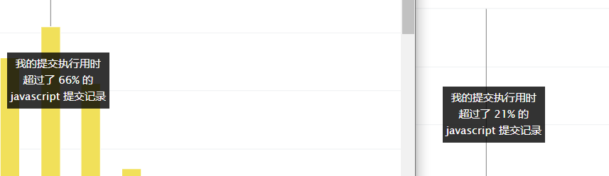

debug.html 提供调试器功能

在练题的过程尽可能多的适用 JS API，以达到熟练适用 JS API 的目的，并不是说时间复杂度最优的算法就是最优，在实际的编写中能够最快达到运行目的并且能够保证接近理论最优复杂度的的代码才是实际的，能够达到最优复杂度的代码需要时间去理解，而适用 API 可以让代码更少且更让人理解，在实际编写中也更有可能应用

# 关于题目难度和公司

大厂的题目中等难度考察的会多一些，像字节跳动前端的中等题出现频率要比简单题多，建议先做几道简单题后再做一道中等题的，用此频率去做题

**提示**

贪心，两个递增序数组，从后往前遍历，每次都取最大值填充，边缘值 -1 指两个数组之一已经遍历完（填充完），只需填充另一个数组

[合并两个有序数组](./code1.js)

动态规划，需要设立求解公式，此题时每次都和上一次比较并得出最大值

[最大子序和](./code2.js)

从尾部相加，进位加 1，可以先把字符串反转，不过开销太大，官方的解法更好，更优雅

[415. 字符串相加](./code4.js)

1. 利用栈实现反转（JS Array）
2. 迭代反转，每次结束都把当前指向节点指向 next，注意 curr 和 next 在结束时是同一指向，而 prev 的指向节点会与 curr 断开

[206. 反转链表](./code5.js)

用栈后进先出的思想和 Ascii 码去求解，当遇到相对应的‘括号’就出栈，什么时候相对应，就是 Ascii 码加 1 || 2 的时候就是相对应的，可以去看一下 [Ascii 码表](https://baike.baidu.com/item/ASCII/309296?fr=aladdin#3)

这里多说一点 code6.js 的一些解释

**一个变量声明就能得到击败 40% 的人的提升？**



```js
// one
let stackTop = stack[stack.length - 1];
if (stackTop + 1 === s.charCodeAt(i) || stackTop + 2 === s.charCodeAt(i)){}
// two
if (stack[stack.length - 1] + 1 === s.charCodeAt(i) || stack[stack.length - 1] + 2 === s.charCodeAt(i)){}
```

one 的写法和 two 的写法区别在哪？one 的写法多了声明，two 的写法多了 2 次计算（假设 stack.length - 1 和 stack 取值算 2 次）

但 one 的写法要比 two 快 12 ms，这是因为在 JS 中声明一个变量的开销很小，相对于为了减少空间复杂度而重复计算的方案更优

[20. 有效的括号](./code6.js)

滑动窗口真的妙呀

[3. 无重复字符的最长子串](./code7.js)

复习组合公式了属于是，官方文档里面从第 5-6 题是不太能看的懂的，矩阵已经很久没有学过了

[70. 爬楼梯](./code8.js)

程序 = 算法 + 数据结构

[141. 环形链表](./code9.js)

<-----------------分割线--------------------->

[155. 最小栈](./code11.js)

1. 使用在栈上添加一个最小值，然后每次 push 和 pop 时维护这个最小值
2. 使用辅助栈，每次 push 都会维护辅助栈相对应的最小值

附加属性-特殊值介绍

1. min 的初值不能设置为 0，压栈元素可能是 0 或者比 0 更小的元素
2. 由于每次弹栈都会维护一次 min，要注意此时栈是否为空，栈为空时 min 应该为 0

[121. 买卖股票的最佳时机](./code12.js)

**突然发现 添加方法注释（类似于 java doc）也可以起到类似 TS 的效果**

```js
// 比如
/**
 * 写代码的过程中 vs code 会认为 prices 是 number[]
 * @param {number[]} prices
 * @return {number}
 */
 var maxProfit = function(prices) {
};
```

